## Group ID

In this exercise you will define a group ID that you will need in the course of this workshop to uniquely identify your repository artifacts and separate them from those of other users conducting the same workshop on this system.

The group ID will be used to replace all occurences of the placeholder ### in the different exercises of this workshop.

⚠ Please note: ⚠
If you've been assigned a group ID by the SAP team, then please skip this section and go directly ahead with the next one to create an ABAP Cloud Project or an ABAP Project in ADT.

## Create an ABAP Cloud Project in ADT

> In this step, you will create a connection to the ABAP system in your ADT installation. To do this, you need to create an **ABAP Cloud Project**.

> Create an ABAP Cloud Project in your ADT installation to connect it to the **SAP BTP ABAP Environment**.

1. Get **SAP BTP ABAP Environment** in BTP sub account.

   If you use your own tenant, get the **SAP BTP ABAP Environment** URL as the following screen shot .

   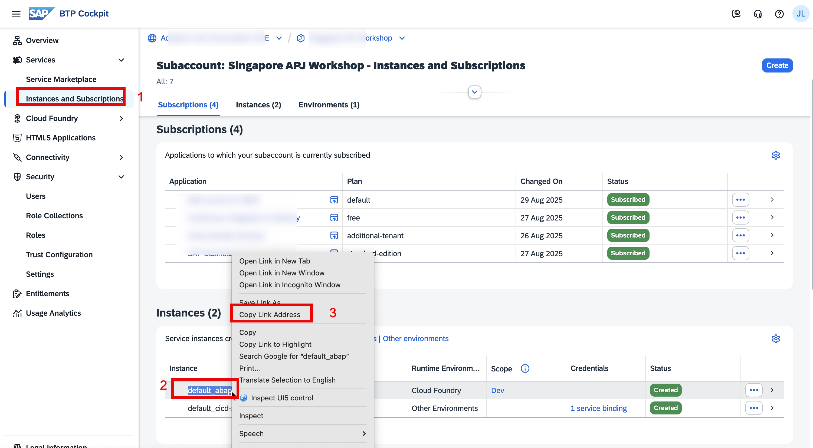

   If you use SAP's internal **SAP BTP ABAP Environment**, use the following URL.

   `https://62a4a40c-d124-4d68-a9e2-5f94e21de440.abap-web.eu10.hana.ondemand.com/ui`

2. Open the **ABAP** perspective if not yet done.

   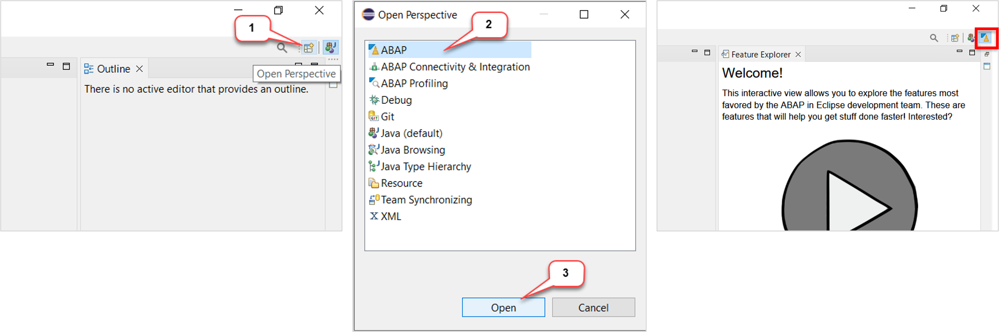

3. Now create the _**ABAP Cloud Project**_ as shown below.

- Give the ABAP Service instances URL and click on **Next**
- Click on **Open Logon in Browser** and enter your user credentials
- In ADT, click on **Finish**

  

  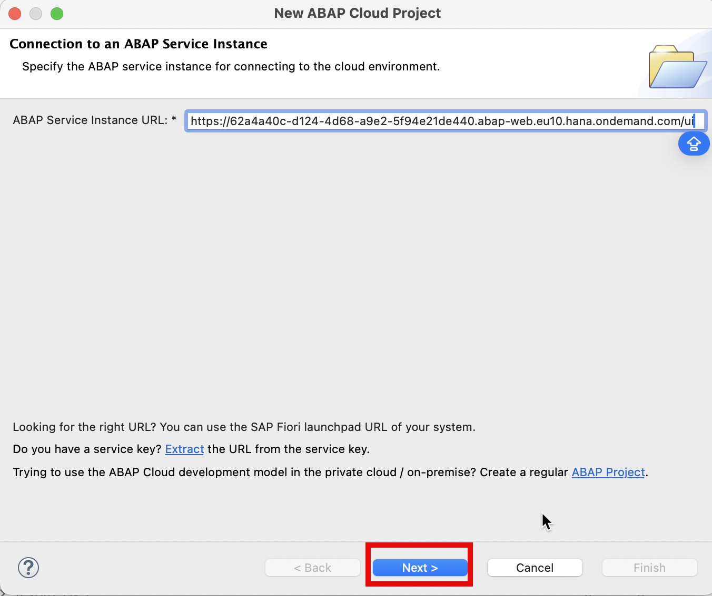

  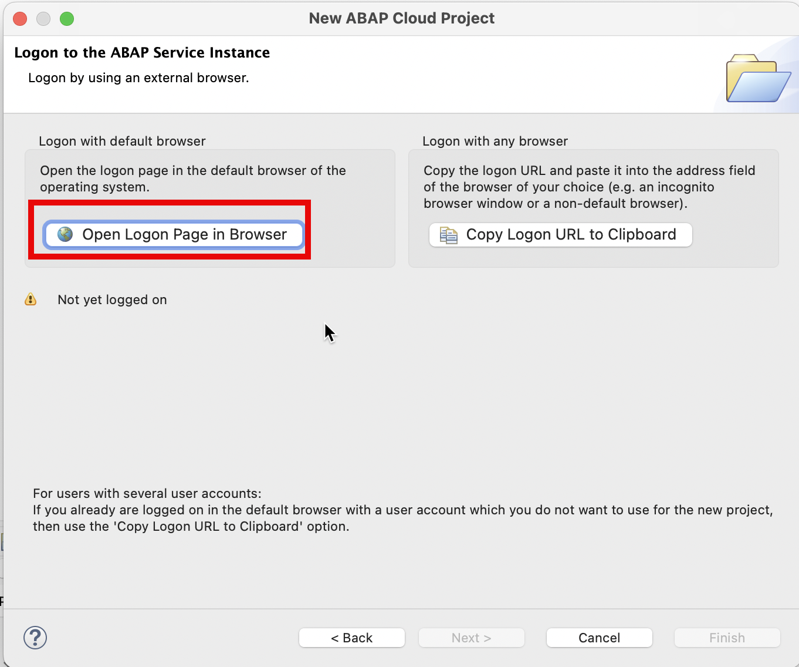

  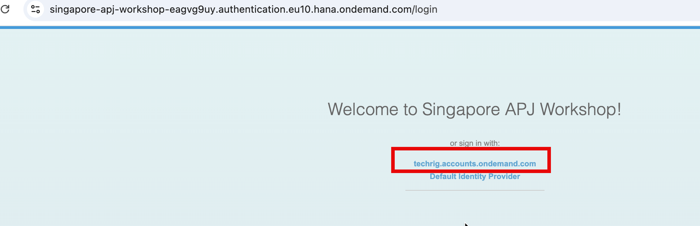

  The following email should have been assigned with role `SAP_BR_DEVELOPER`, if you use SAP internal system, we will provide you a user account .

  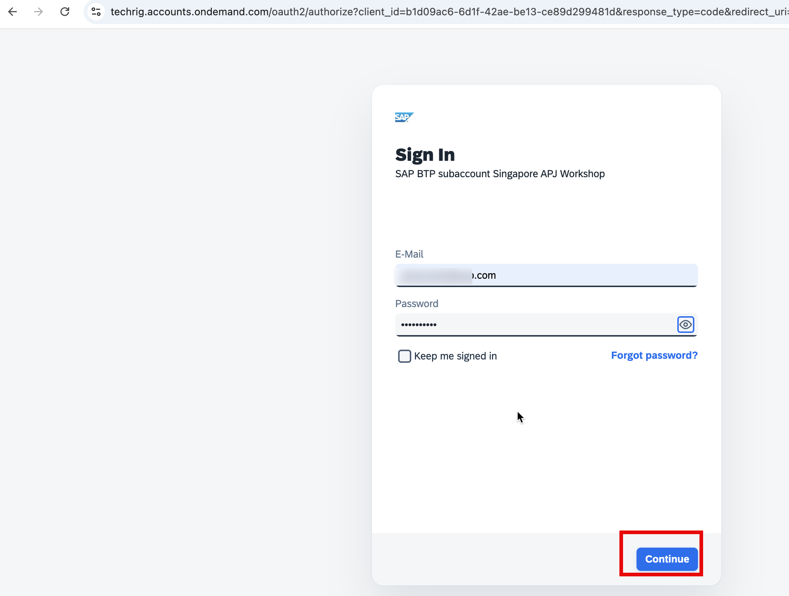

  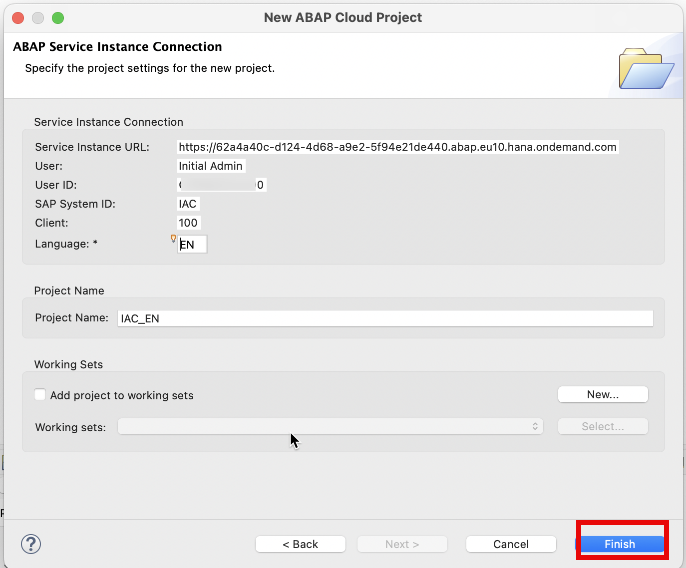

  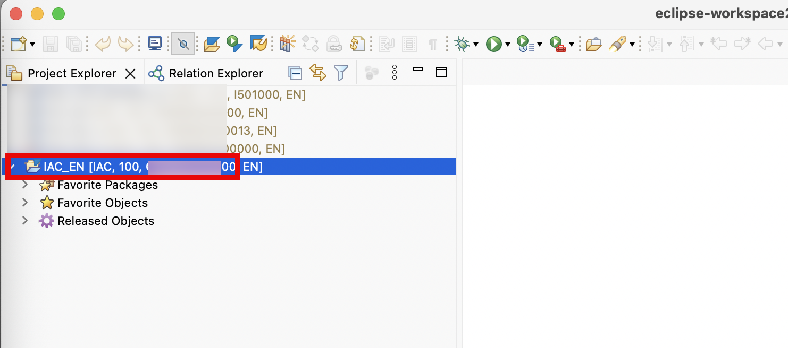

4. Add package `zlocal` to your favorite packages.
   <!--    -->

   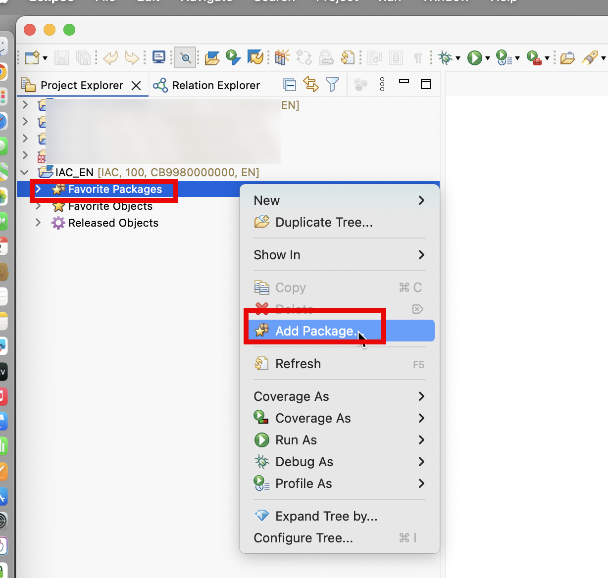

   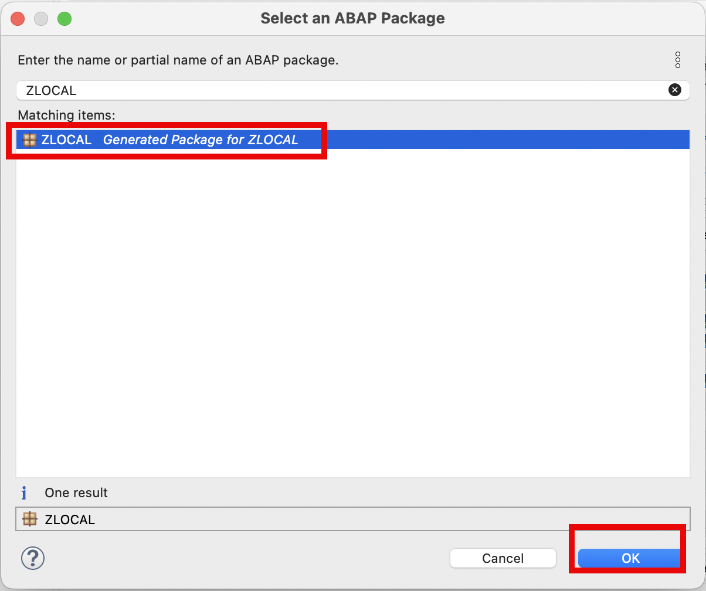

   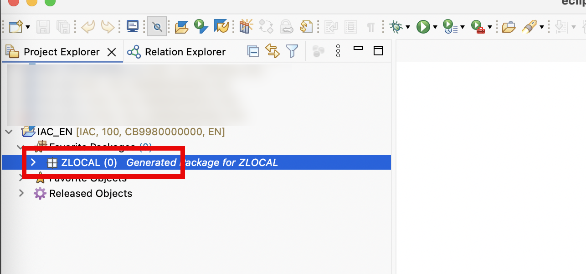

## Create package in Eclipse ADT

Create your exercise package**`ZRAP_ISLM_###`**.

1.  In ADT, go to the **Project Explorer**, right-click on the package **`ZLOCAL`**, and select **New** > **ABAP Package** from the context menu.

    <!-- 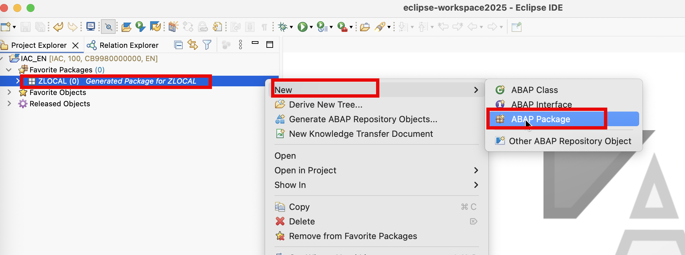 -->

    

2.  Maintain the required information:

    > Note: **`###`** is your assigned group ID or chosen suffix. Please choose a suitable combination of three (3) numbers and characters, e.g. **`476`** or **`ZT1`**

    - Name: **`ZRAP_ISLM_###`**
    - Description: _**`RAP ISLM Package ###`**_
    - Select the box `☑️` **Add to favorites package**
    - Superpackage: **`ZLOCAL`**

    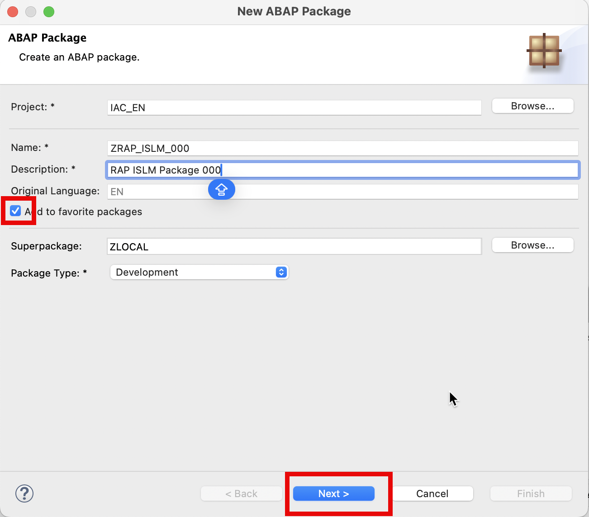

    Click **Next >**.

    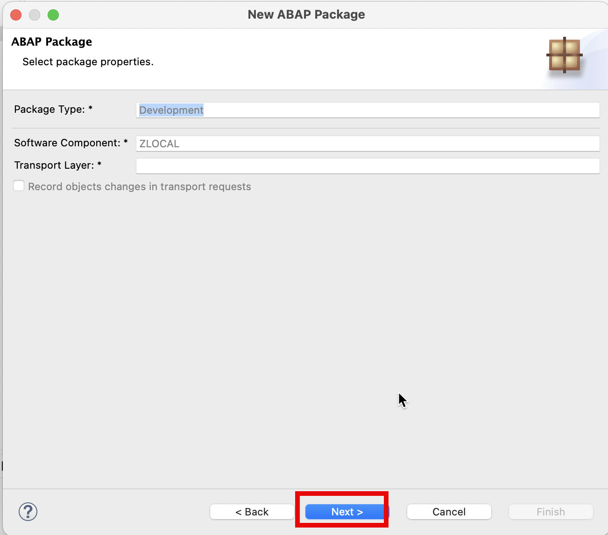
    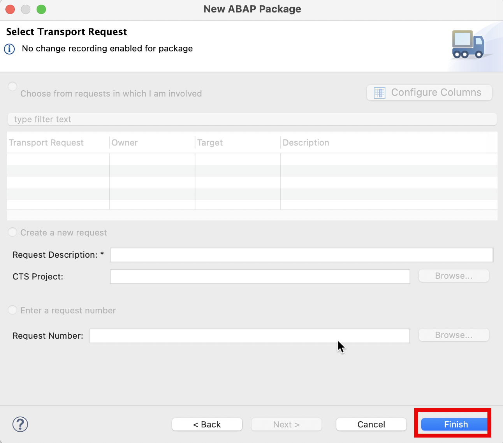

    In our own tenant, please select `Create a new request` and fill the field `Request Description .`
