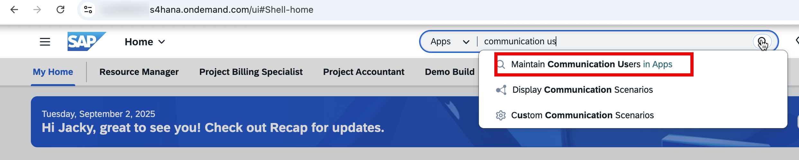
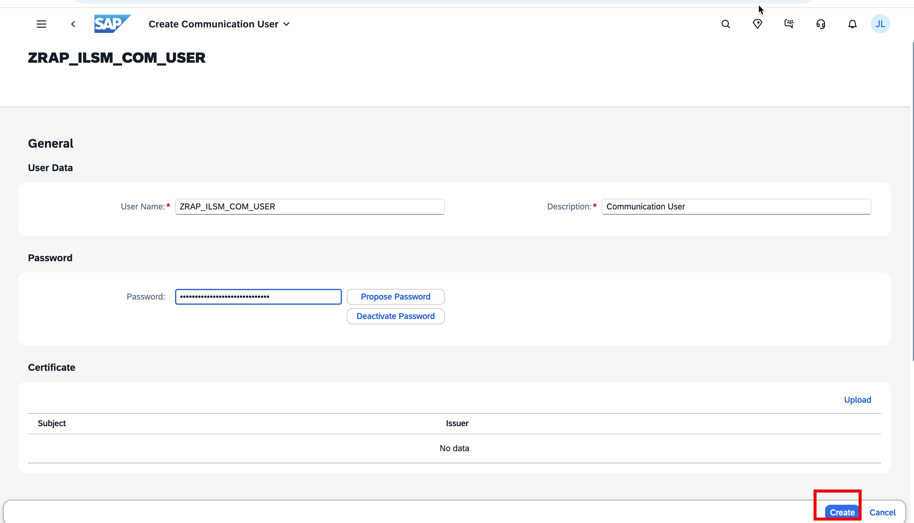
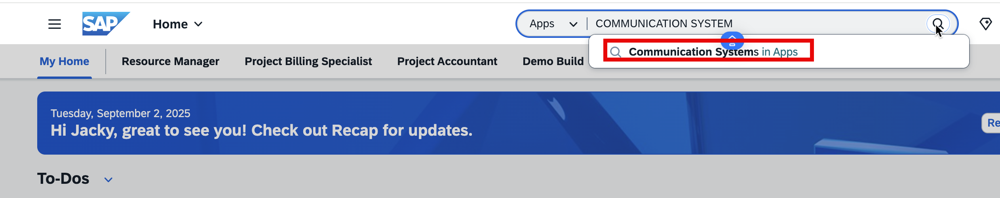
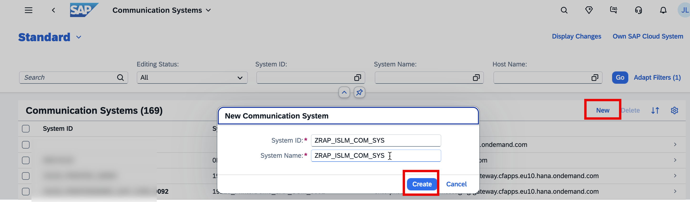
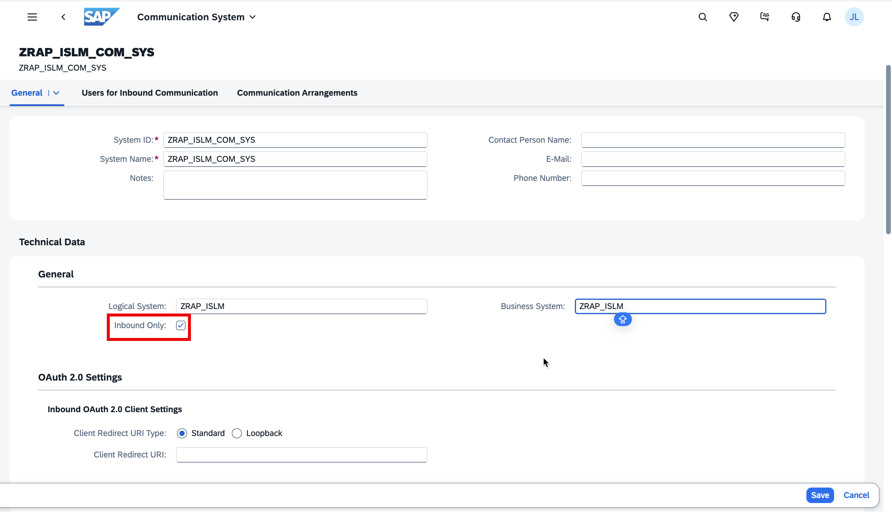
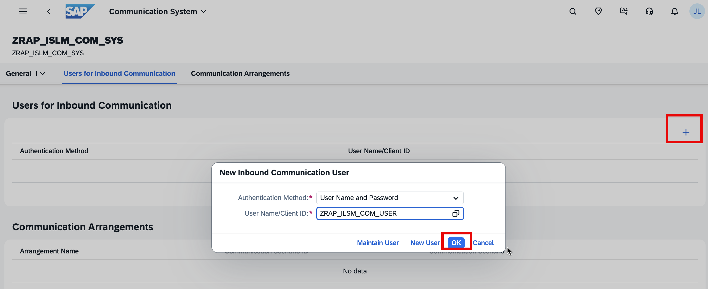
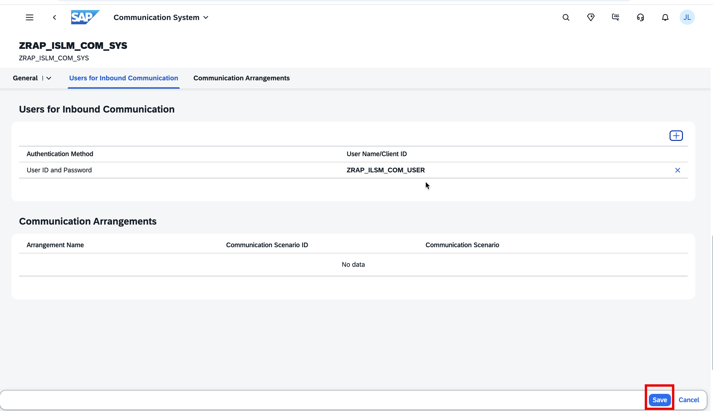
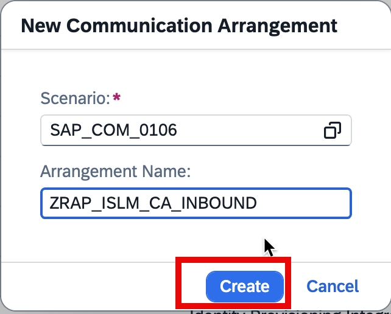
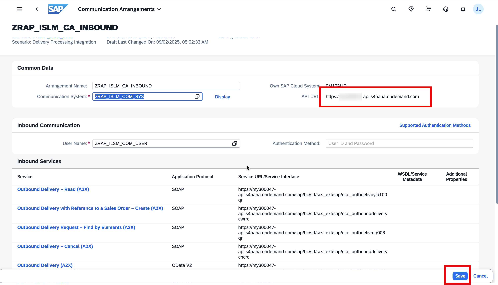
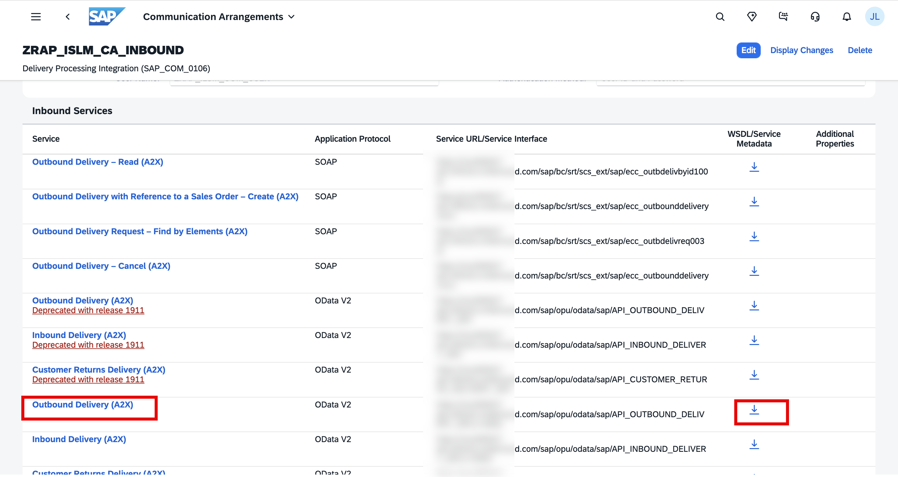

## Create a Communication User in SAP S/4HANA Cloud, public edition

Create a communication user in SAP S/4HANA Cloud, public edition. This technical user will be used for the inbound connectivity of SAP S/4HANA Cloud, public edition and outbound connectivity of the SAP BTP, ABAP environment.

1. Open the SAP Fiori Launchpad of the customizing tenant (100) of your SAP S/4HANA Cloud, public edition development system.

2. Access the **Maintain Communication Users** app
   

3. Choose button **New**

4. Provide User Name `ZRAP_ILSM_COM_USER` and Description `Communication User` to get Outbound Deliveries.

   

5. Choose button **Propose Password**

6. Store proposed password for later use.

7. Choose button **Create**

## Create a Communication System in SAP S/4HANA Cloud, public edition

Create a communication system in SAP S/4HANA Cloud, public edition. This is used to model the external communication partner and to specify the authentication methods and users which are allowed.

1. Access the **Communication Systems** app
   

2. Choose button **New**
   

3. Provide System ID `ZRAP_ISLM_COM_SYS` and System Name `ZRAP_ISLM_COM_SYS`

4. Choose button **Create**

5. In the Section General tab provide the following information:

   - Logical System: `ZRAP_ISLM`
   - Business System: `ZRAP_ISLM`
   - Choose **Inbound Only**
     

6. In the Users for Inbound Communication tab provide the following information:

   Choose + to add an Inbound User

   Choose Authentication Method: **User Name and Password**

   Provide User Name / Client ID: `ZRAP_ILSM_COM_USER`

   Choose button **OK**

   

   The result is that the user created in the previous step is now added as inbound communication user

   

7. Choose **Save** to save the communication system.

## Create the Communication Arrangement in SAP S/4HANA Cloud, public edition

Create a communication arrangement based on the communication scenario `SAP_COM_0106` in SAP S/4HANA Cloud, public edition. The **Outbound Delivery (A2X)** API is part of this standard scenario. You will use the previously created communication system and user, thus defining how to authenticate and authorize against the exposed service.

1. Access the **Communication Arrangements** app

2. Choose button **New**

3. Choose Scenario `SAP_COM_0106`

4. Provide Arrangement Name: `ZRAP_ISLM_CA_INBOUND`

5. Choose button **Create**
   
6. On the next screen provide the following information:
   

- Communication System: `ZRAP_ISLM_COM_SYS`. For inbound communication the **User Name** and **Authentication** Method is set automatically from the communication system.
- Store **API-URL** for later use
- Choose **Save**
  
