## Create an Outbound Service

> Create an outbound service object, which models the outbound call that will be implemented. The outbound service will be part of a custom communication scenario.

1. In ADT, right click on package `ZRAP_ISLM_###` and choose **New** > **Other ABAP Repository Object**

   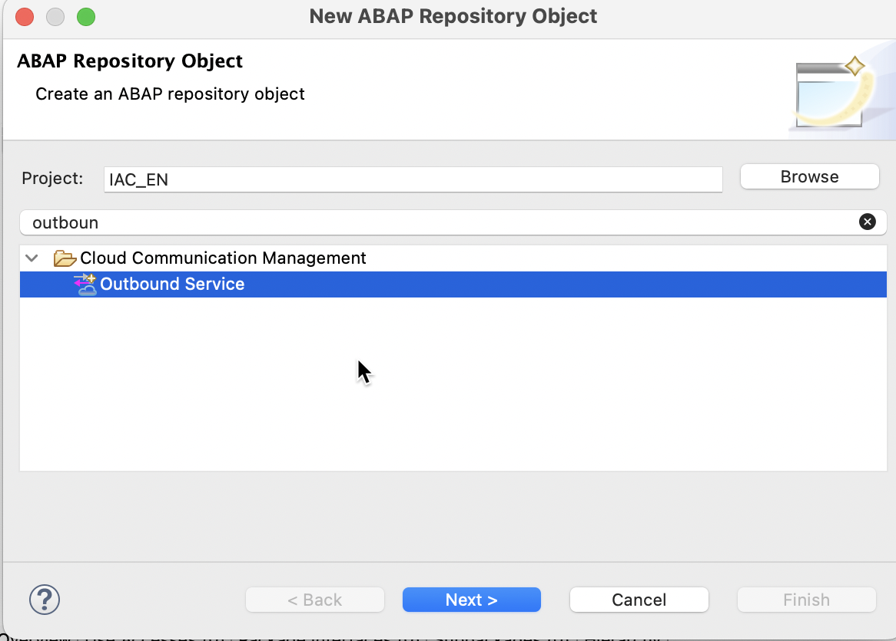

   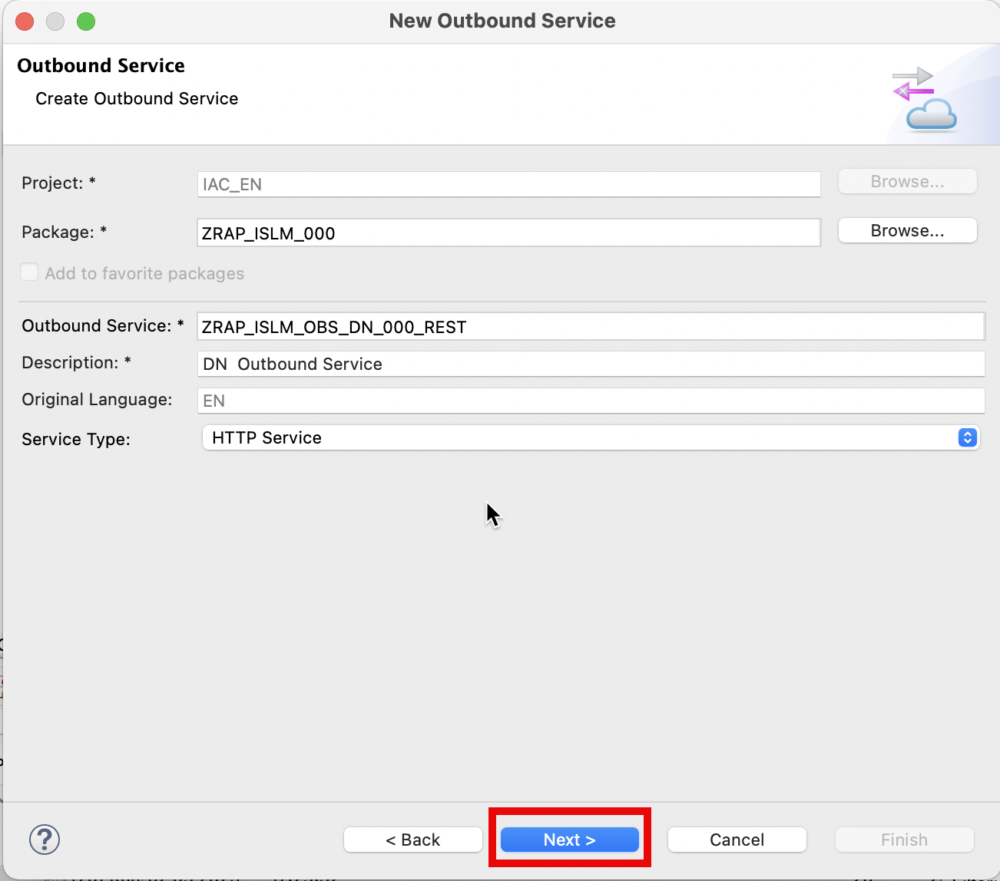
   - Outbound Service: `ZRAP_ISLM_OBS_DN_###_REST`
   - Description: `DN Outbound Service`
   - Service Type: `HTTP Service`

     Choose **Next**

   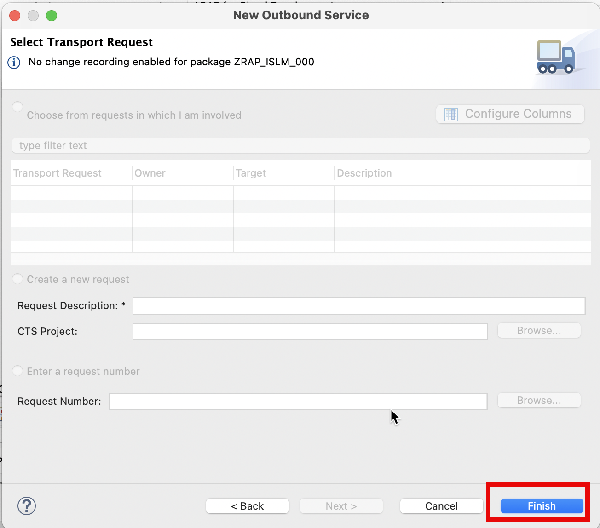

   No transport request is necessary, as change recording is not enabled. Choose Finish.

   In the newly created Outbound Service set the Default Path Prefix parameter to `/sap/opu/odata/sap/API_OUTBOUND_DELIVERY_SRV;v=0002` and save the Outbound Service.

   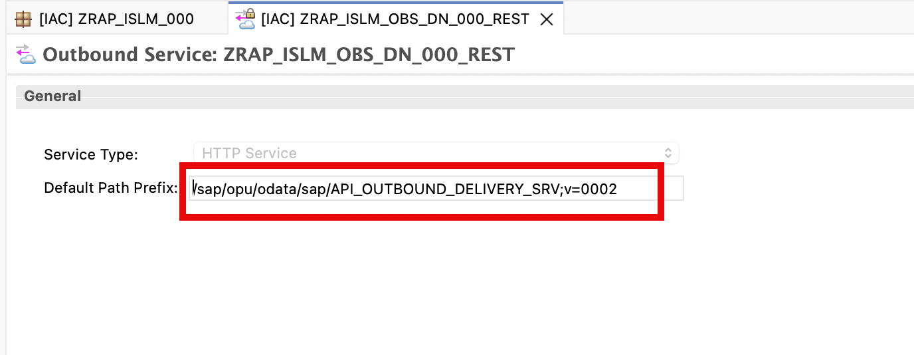

   > The Path parameter can be retrieved from the [Outbound Delivery (A2X)](https://api.sap.com/api/API_OUTBOUND_DELIVERY_SRV_0002/overview) under Configuration Details > PRODUCTION URL. You will need to remove the https://{host}:{port} part of the URL.

## Create a Communication Scenario

    Create a communication scenario and assign the outbound service to it. This will be the basis for the outbound communication arrangement, which will be configured by an administrator at a later point. Keep in mind that the developer defines which authentication methods are supported, while the administrator decides which authentication method is ultimately used at runtime.

1. In ADT, right click on package `ZRAP_ISLM_###` and click on File and choose **New** > **Other ABAP Repository Object** :

   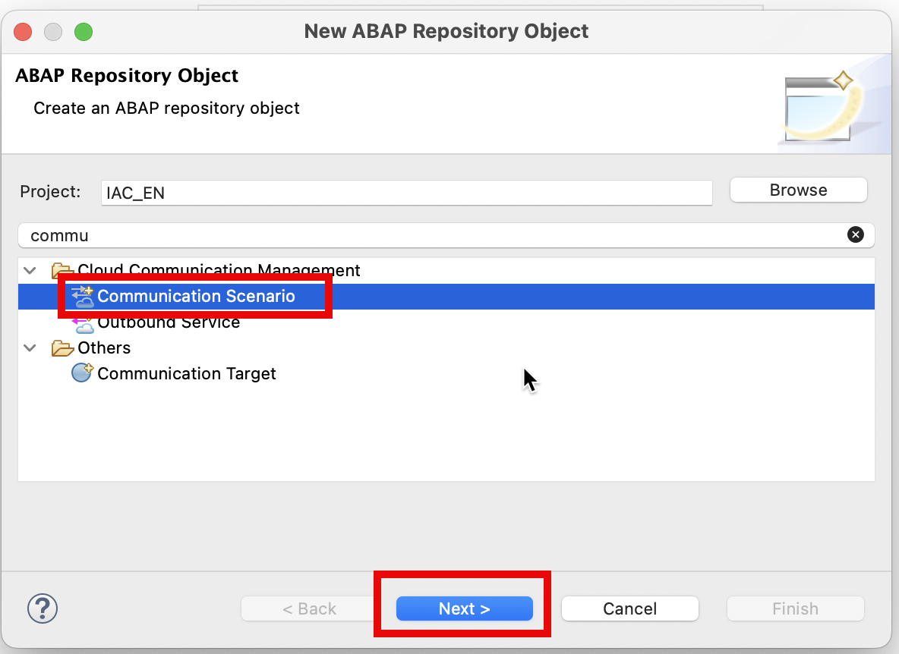

   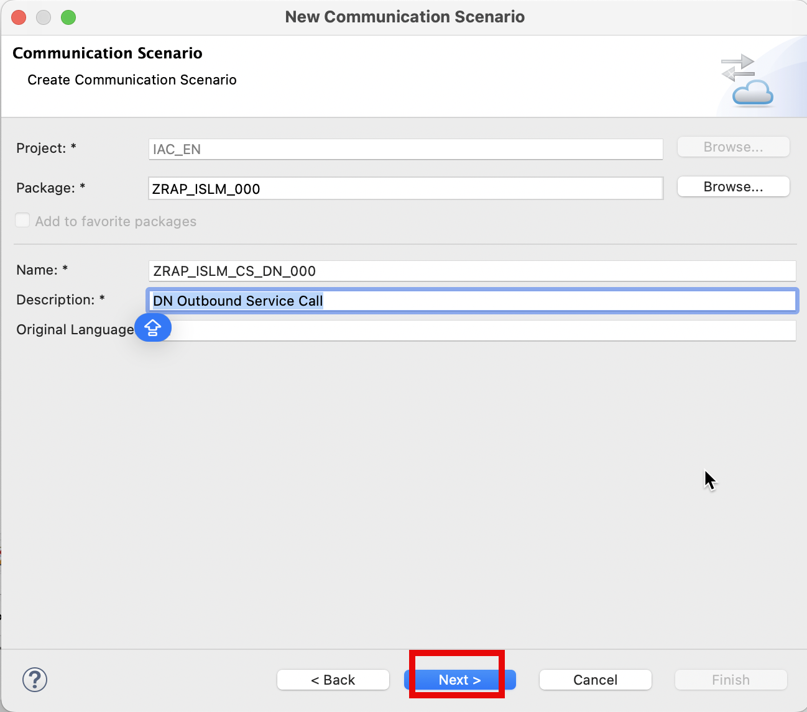
   - Name: `ZRAP_ISLM_CS_DN_###`

   - Description: `DN Outbound Service Call`

     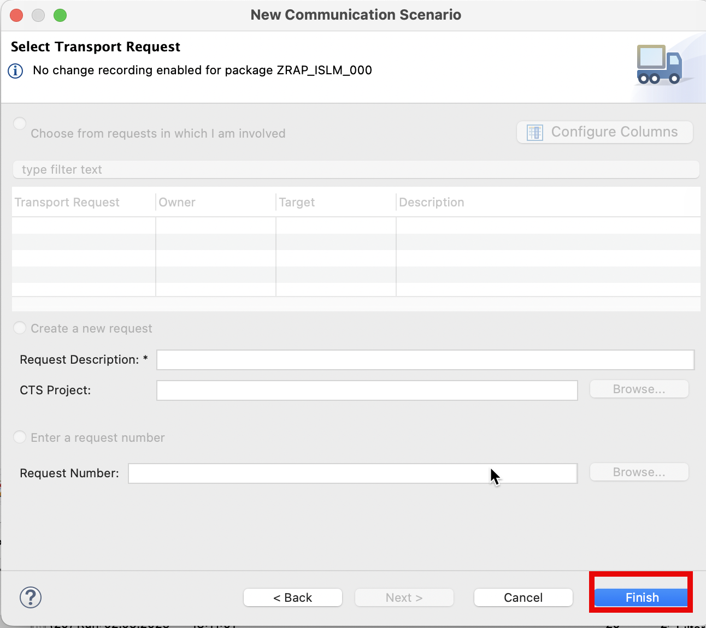

   No transport request is necessary, as change recording is not enabled. Choose **Finish**

   In this hands-on, we assume that the Communication Scenario only needs to be setup once per client and no receiver determination is needed (for more information, see Service Consumption via Communication Arrangements). Select “One instance per client” from the Allowed Instances dropdown list:

   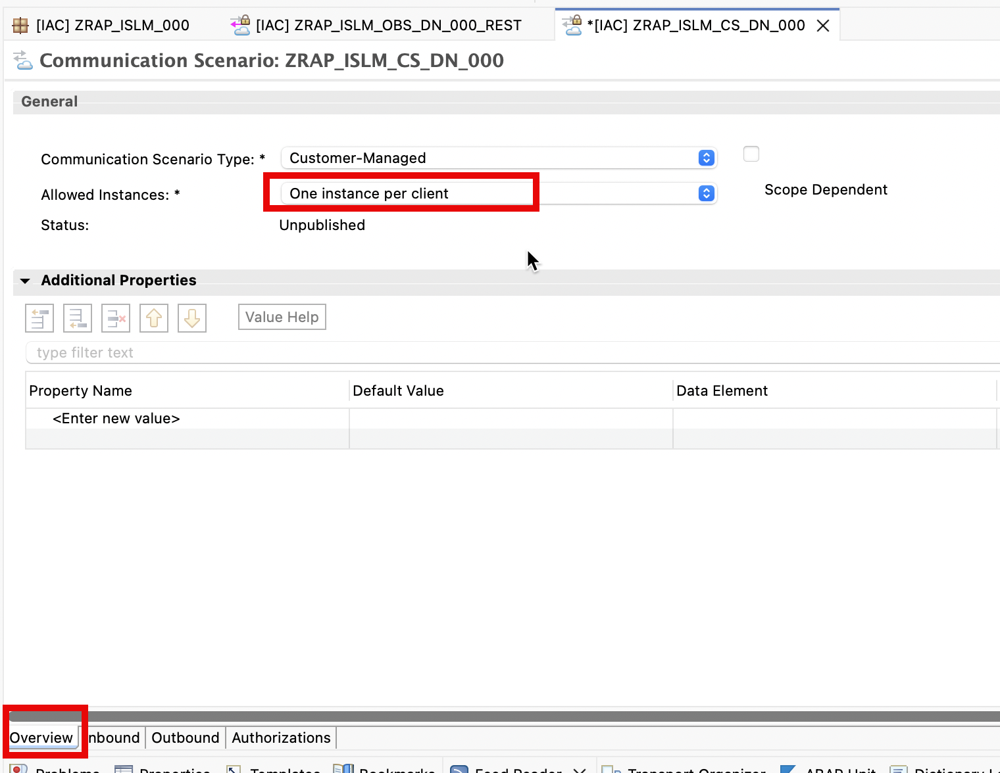

   Choose Tab Outbound and Add the Outbound Service created before: `ZRAP_ISLM_OBS_DN_000_REST`. The Default Path Prefix field should be filled automatically according to the Default Path Prefix set for the Outbound Service in the previous step. If that is not the case, click on the button Synchronize.

   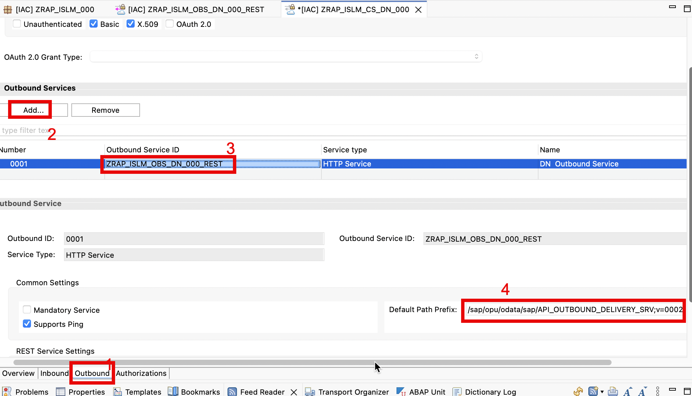

   Choose the Authentication Methods **Basic** and **X.509** to permit basic and certificate-based authentication via communication user. Choose Authentication Method **OAuth 2.0** with Grant Type SAML 2.0 Bearer Assertion to permit principal propagation.

   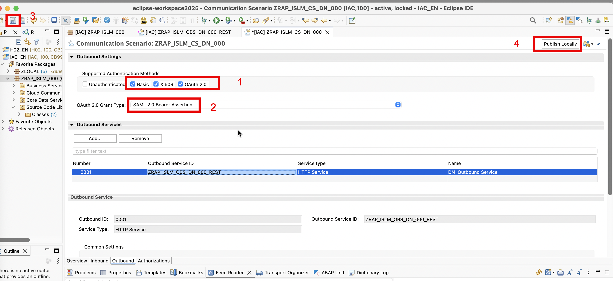

   **Save** the communication scenario.

   Choose **Publish Locally**.

## Create a Communication Arrangement and Communication System in SAP BTP, ABAP environment

Configure the outbound connectivity in SAP BTP, ABAP environment. Create a communication arrangement based on your custom communication scenario, as well as a communication system and an outbound communication user. The communication system will contain the target host of the SAP S/4HANA Cloud, public edition system, while the communication user will need to match the inbound user defined in the target system.

1. Open SAP Fiori Launchpad of your SAP BTP ABAP environment system.

   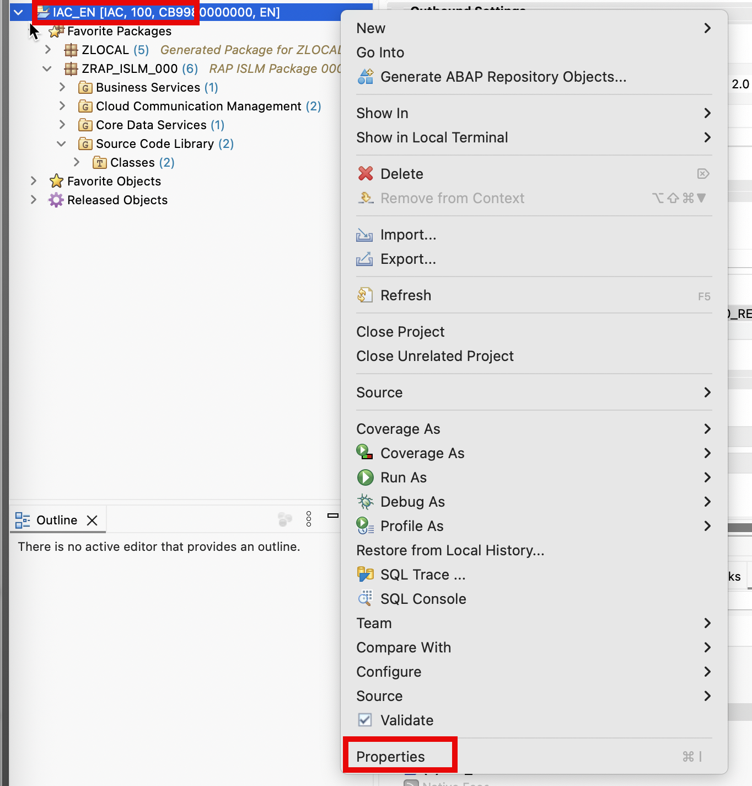

   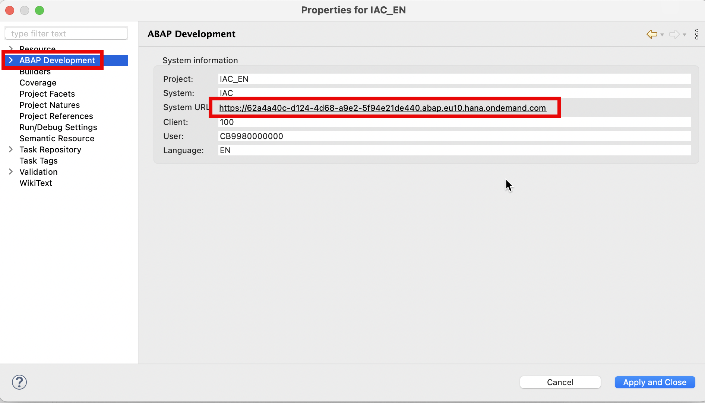

2. Access the Communication Arrangements app

   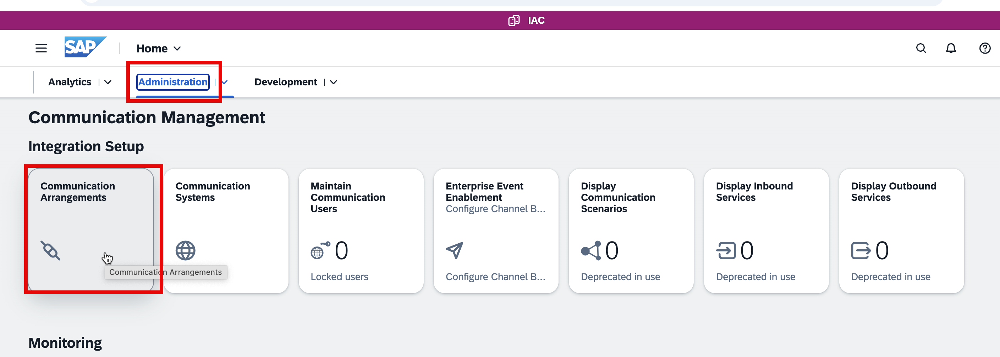

3. Choose button **New**

   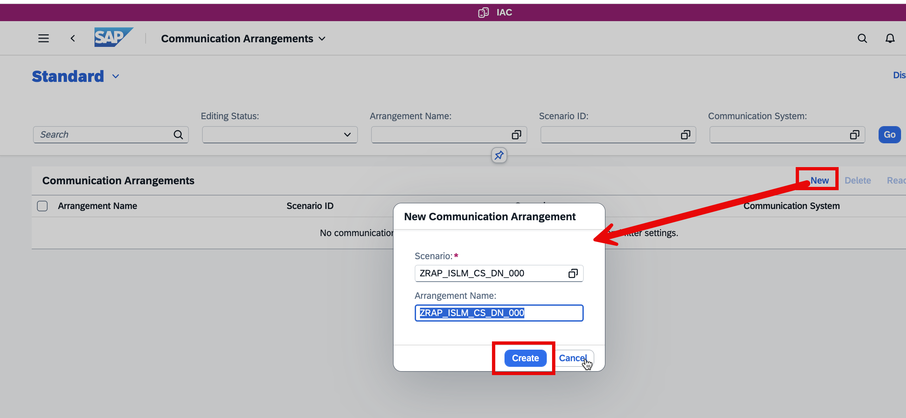

4. Choose Scenario `ZRAP_ISLM_CS_DN_###` created before

5. Provide Arrangement Name: `ZRAP_ISLM_CS_DN_###`

6. Choose button **Create**

7. Choose button New to create a new Communication System

   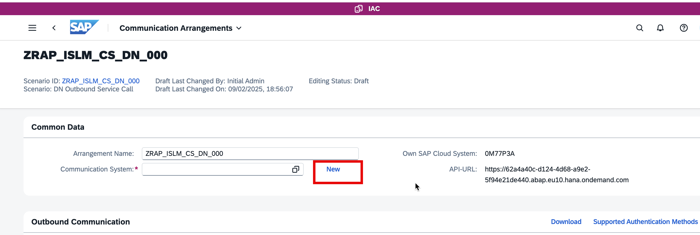

8. Provide:
   - System ID: `ZRAP_ISLM_COM_SYS_S4H_###`

   - System Name: `ZRAP_ISLM_COM_SYS_S4H_###`

     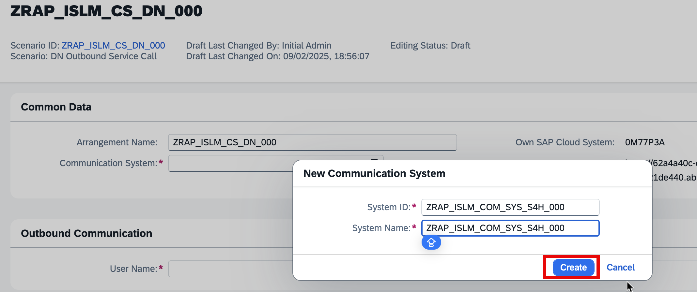

9. In the Communication System screen, General section, provide:

> If you use SAP internal system we provide communication system information as the following:

Host: `https://my300047-api.s4hana.ondemand.com`
Port: `443`
Communication User: From [Configure S4](../02-configure-s4hc/README.md)
PassWord: From [Configure S4](../02-configure-s4hc/README.md)

> If you need to connect your own SAP S/4HANA Cloud, please refer to [Configure SAP S/4Hana Cloud](../19-configure-s4hc/README.md)

> If you need to connect your own SAP S/4HANA Private Cloud or On Premise, please refer to [Configure SAP S/4Hana Private Cloud](../20-configure-S4/README.md)

- Host Name: Host without `https://`

- Business System: `ZRAP_ISLM_COM_SYS_S4H_###`

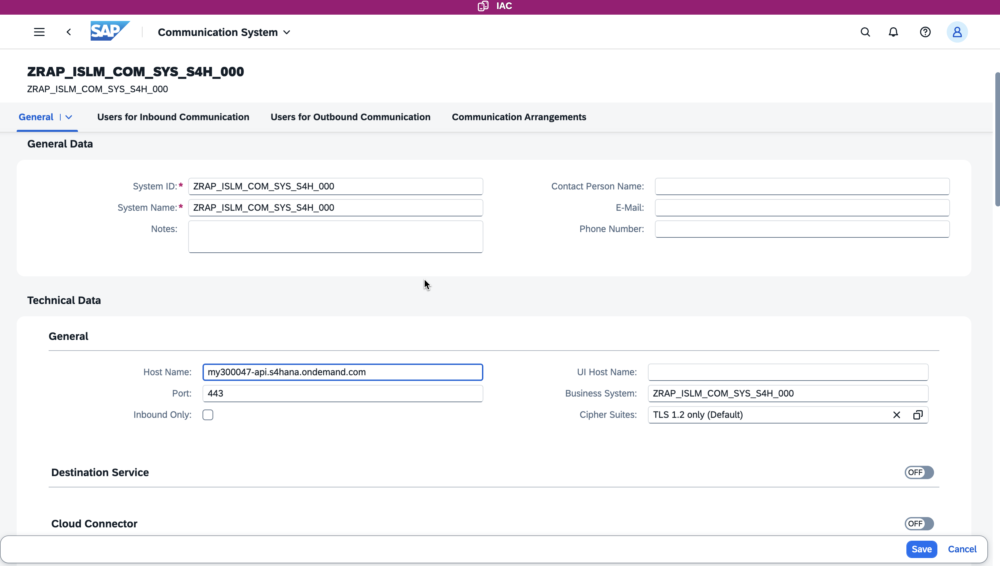

10. In the Users for **Outbound Communication** section

- Choose +

- Provide User Name / Client ID: User created in STEP 9

- Provide Password: Password created and stored in STEP 9

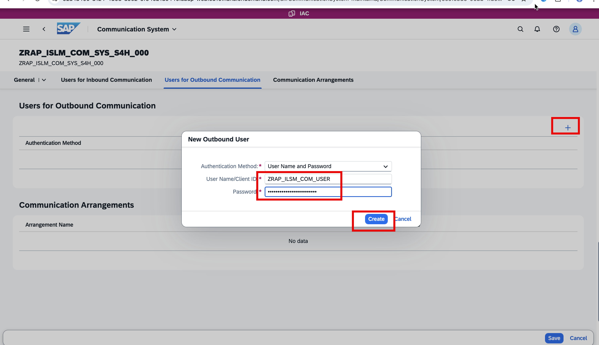

- Choose button **Create**

11. Choose **Save** to save the **Communication System**

12. Verify the Authentication Method is User ID and Password

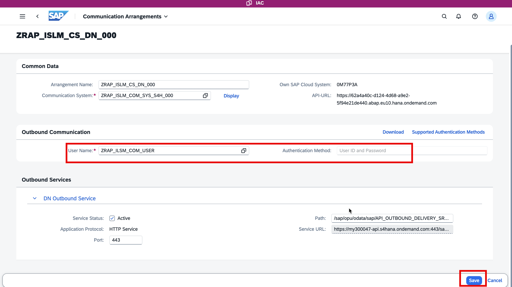

13. Choose **Save** to save the **Communication Arrangement**

> You have now successfully integrated SAP BTP, ABAP Environment and your SAP S/4HANA Cloud, public edition system using Basic Authentication.
