## Create the Service Consumption Model

## Introduction

In this exercise you will learn how to consume an OData Service from an SAP S/4HANA Cloud System or SAP S/4Hana PCE(S4H). We use Outbound Delivery API to extract data from S4H.

1. The EDMX file of the OData service that we want to consume must be uploaded in file format. You have hence to download it first.

- Click on the following URL https://api.sap.com/api/API_OUTBOUND_DELIVERY_SRV_0002/overview

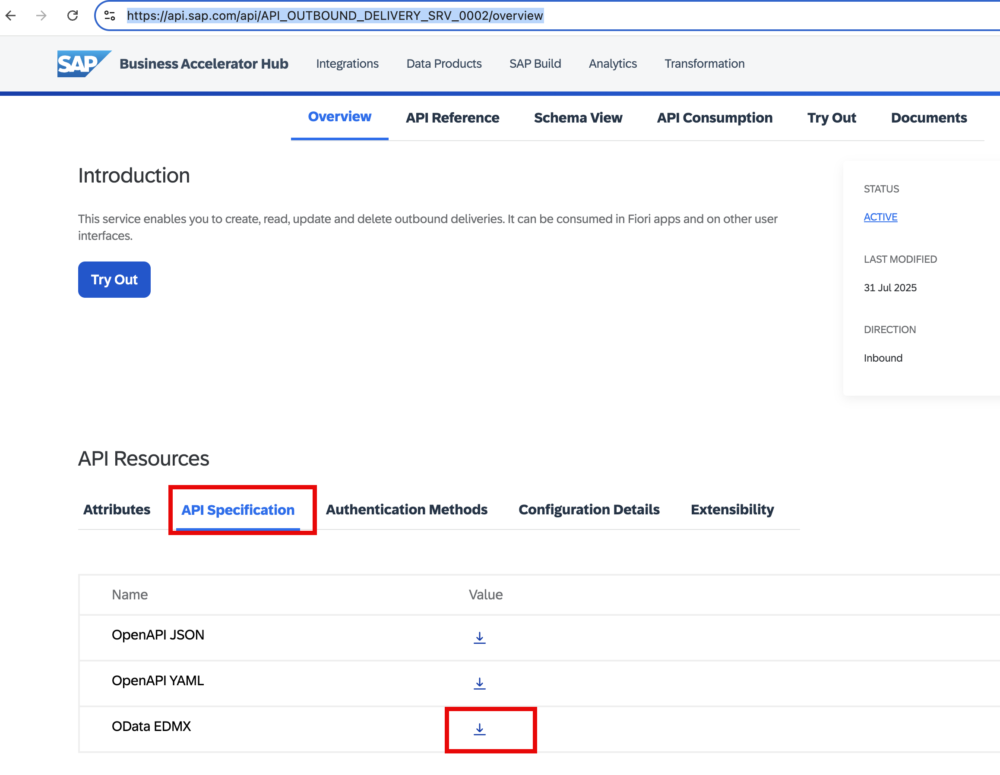

2. Switch to ADT and right click on your package **`ZRAP_ISLM_###`**. Select **New > Other ABAP Repository Object**.

   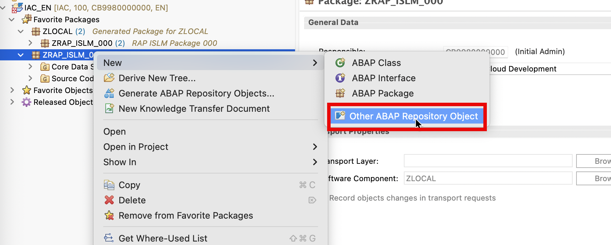

3. In the New ABAP Repository Object dialogue do the following

   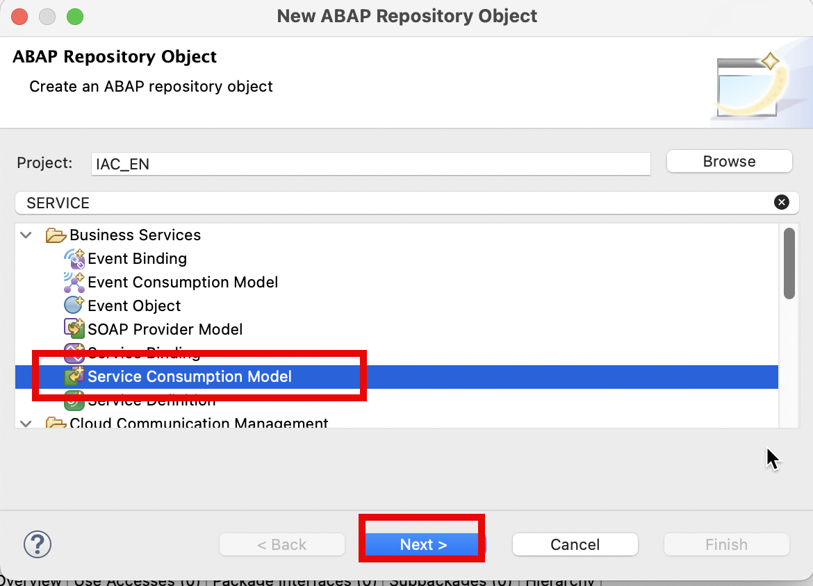

   - Start to type **`Service`**
   - In the list of objects select **Service Consumption Model**
   - Click **Next**

4. The **New Service Consumption Model** dialogue opens. Here enter the following data:

   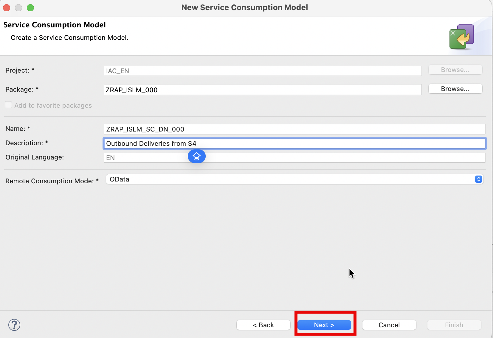

   - Name: **`ZRAP_ISLM_SC_DN_###`**
   - Description: **`Outbound Deliveries from S4`**
   - Remote Consumption Model: **`OData`** (to be selected from the drop down box)

   Then click **Next**.

5. The $metadata file of the OData service that we want to consume must be uploaded in file format. If you have not yet downloaded the $metadata file you have to do this now.

   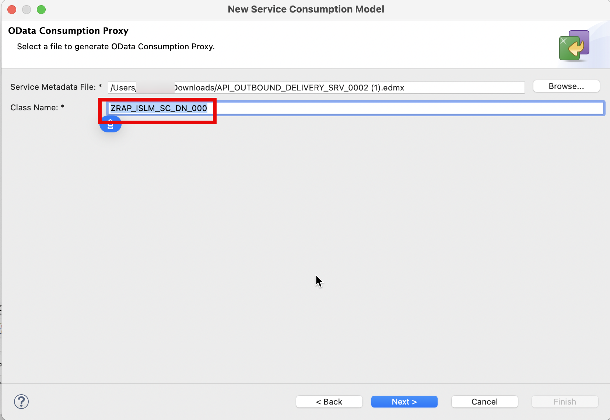

   - Click **Browse** to select the $metadata file that you have downloaded earlier in this exercise
   - Class Name: **`ZRAP_ISLM_SC_DN_###`**

   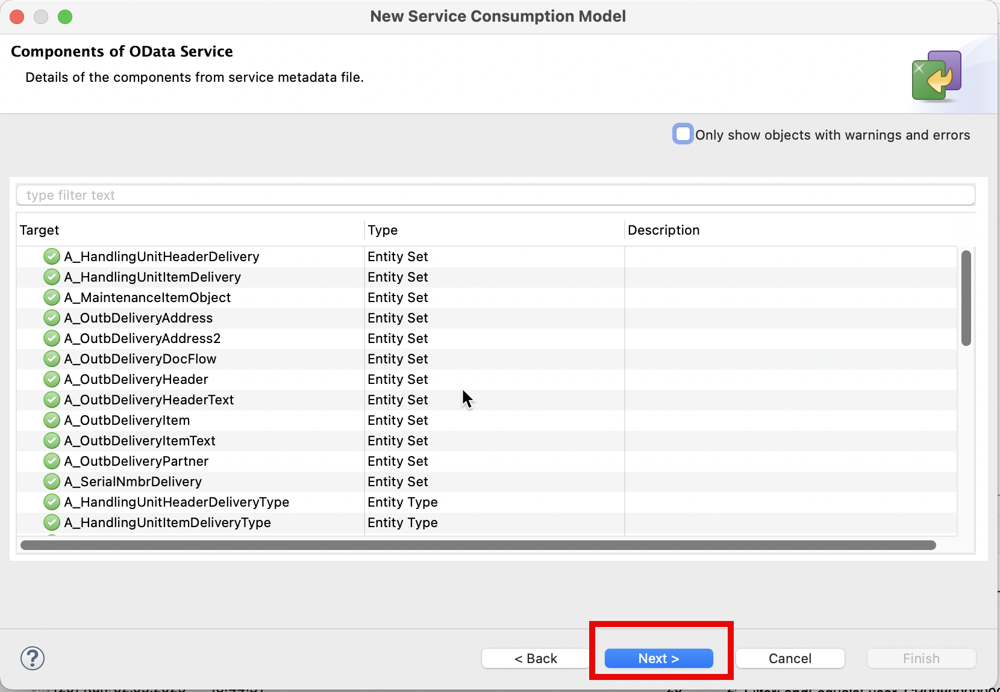

6. Check the **Components of the OData Service** and click **Next**.

   
   Press **Next**.

7. The wizard will now let you choose for which entity sets support for etags should be added.

   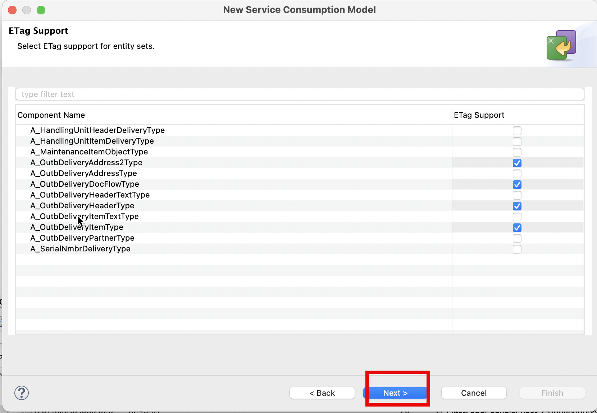

   Press **Next**.

8. Selection of transport request

   - Select or create a transport request you use your own tenant
   - Press **Finish**

     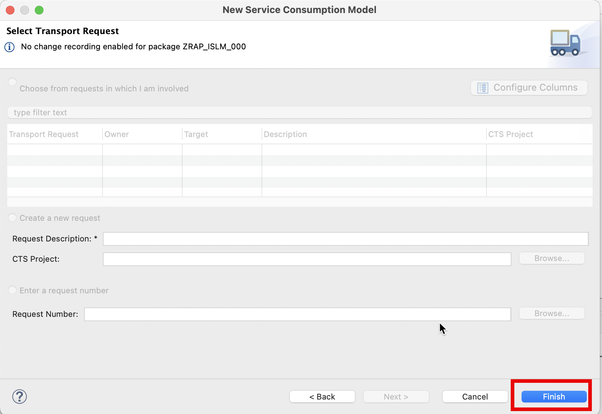

9. When you check the content of your package you will notice that it contains two objects.

   - The service consumption model
   - The service consumption model class

   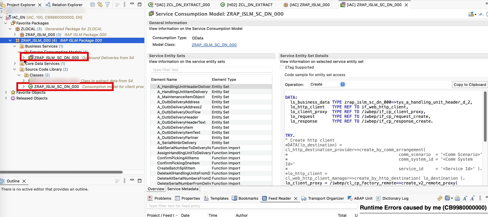

10. Select the Service Consumption Model and press the **Activate** button press or **Ctrl+F3**

    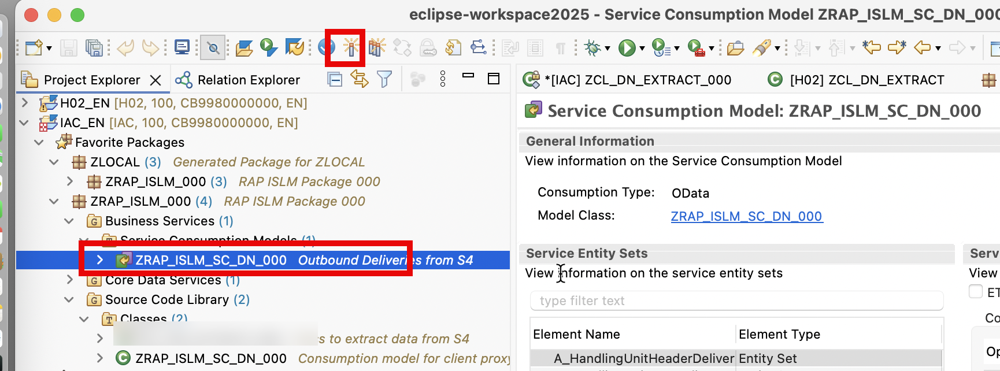

11. Select the Class and press the **Activate** button press or **Ctrl+F3**

    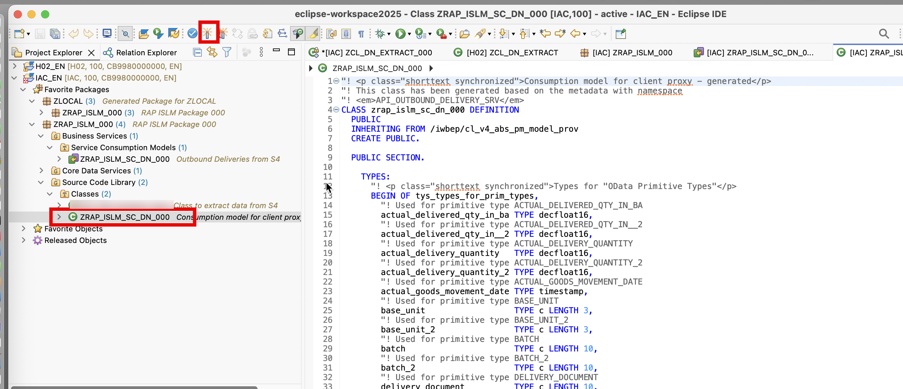
