# Create Entities

## Introduction

In this exercise, you will create data a custom entity with data from SAP S/4Hana Cloud.

> ℹ️ **Reminder:**
>
> - Don't forget to replace all occurences of the placeholder **`###`** with your group ID in the exercise steps below.
> - You can use the ADT function **Replace All** (**Ctrl+F**) for the purpose

## Exercises

<!-- ## Create package

Create your exercise package**`ZRAP_ISLM_###`**.

1.  In ADT, go to the **Project Explorer**, right-click on the package **`ZLOCAL`**, and select **New** > **ABAP Package** from the context menu.

    

2.  Maintain the required information:

    > Note: **`###`** is your assigned group ID or chosen suffix. Please choose a suitable combination of three (3) numbers and characters, e.g. **`476`** or **`ZT1`**

    - Name: **`ZRAP_ISLM_###`**
    - Description: _**`RAP ISLM Package ###`**_
    - Select the box `☑️` **Add to favorites package**
    - Superpackage: **`ZLOCAL`**

    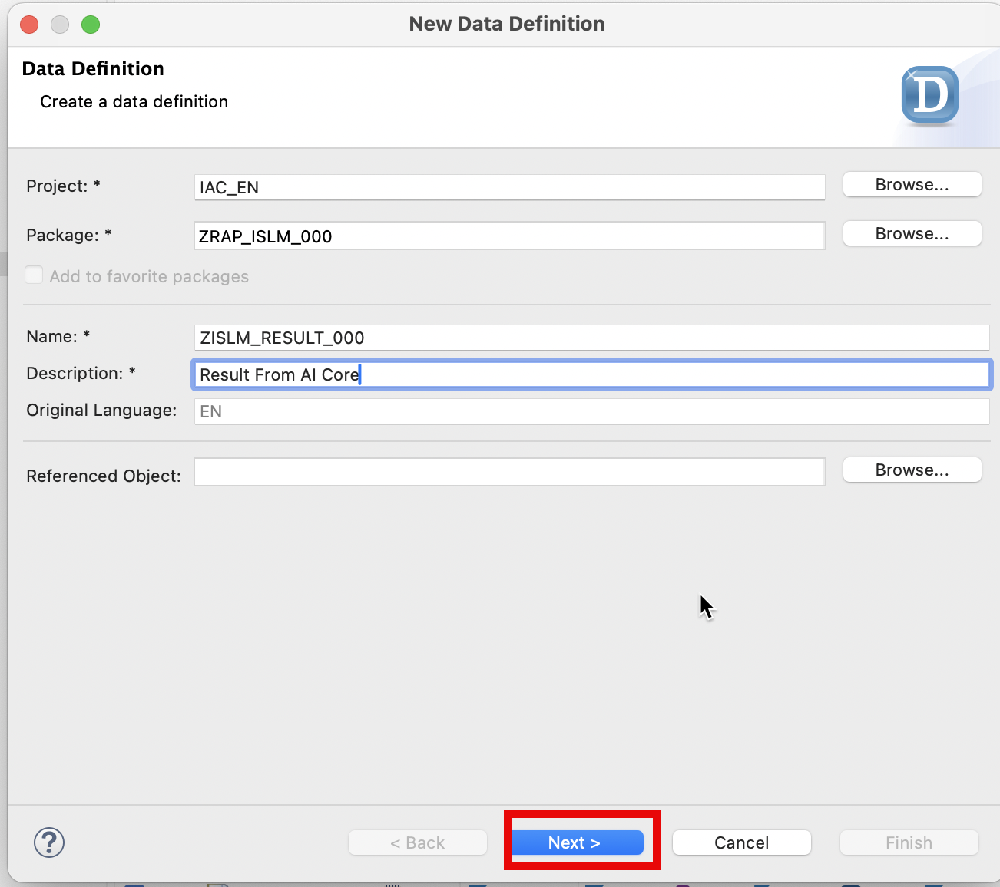

    Click **Next >**.

    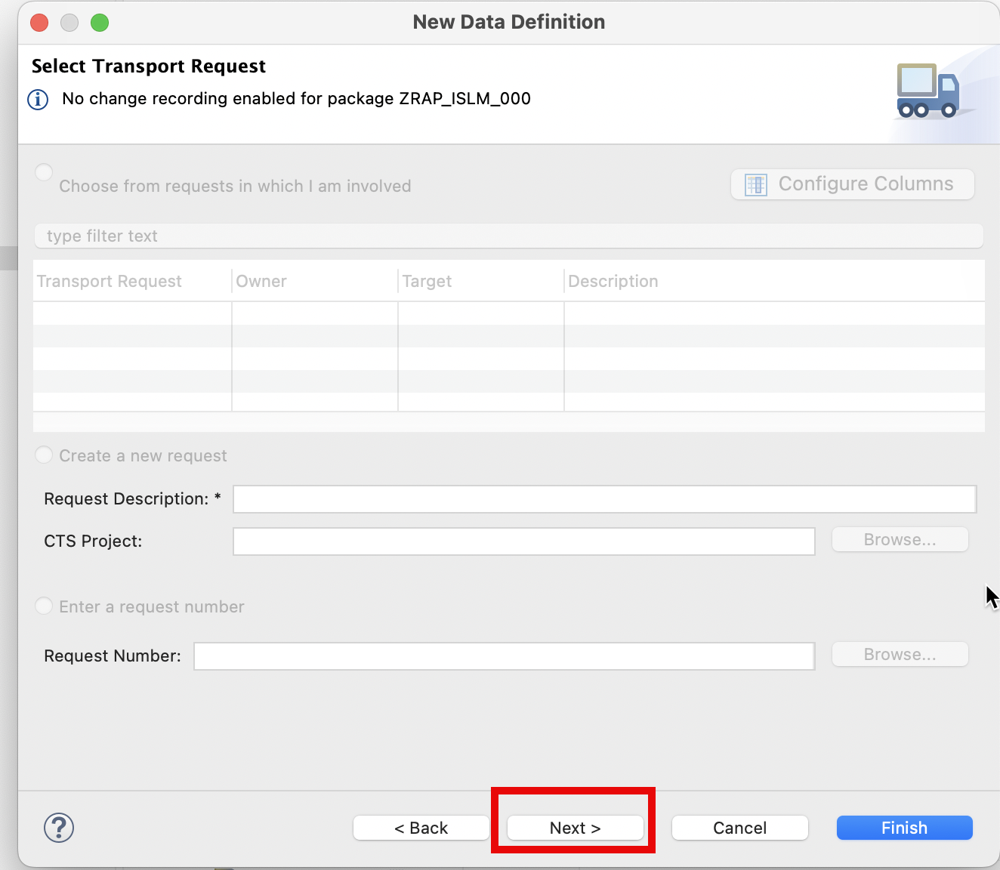
    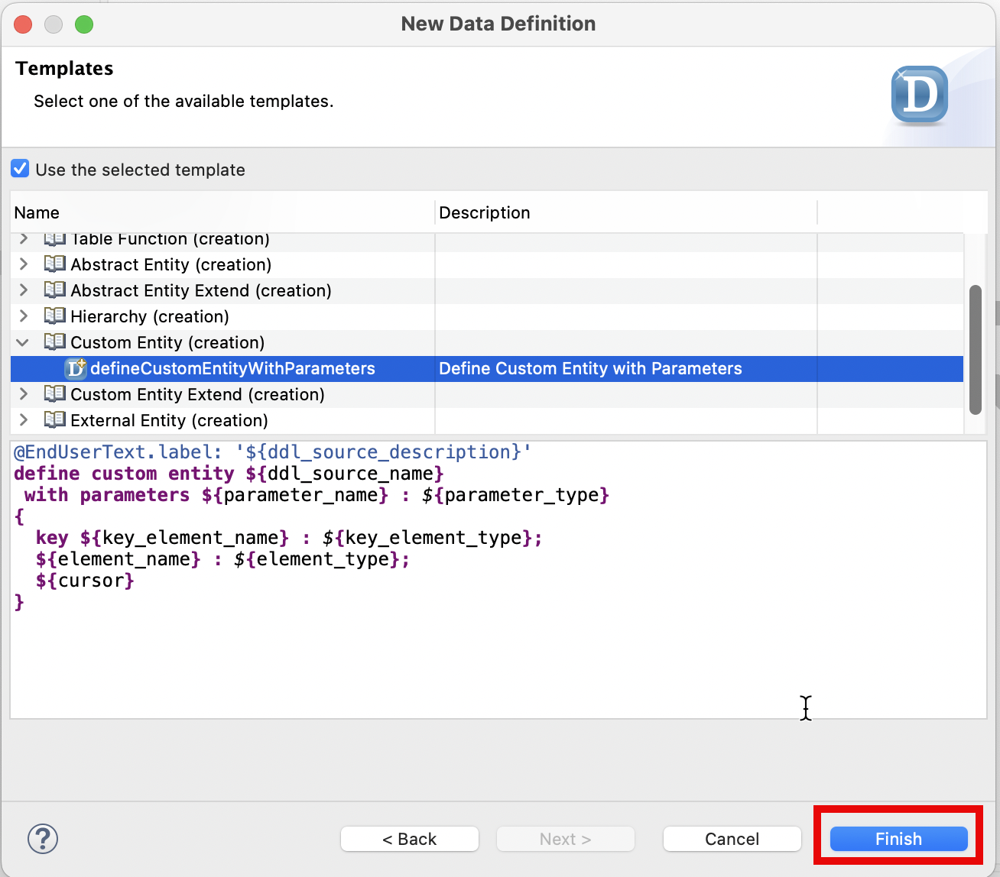

    In our own tenant, please select `Create a new request` and fill the field `Request Description .` -->

## Create custom entity `ZDN_HEADER_###`

1. In Eclipse ADT, right click package  `ZRAP_ISLM_###`

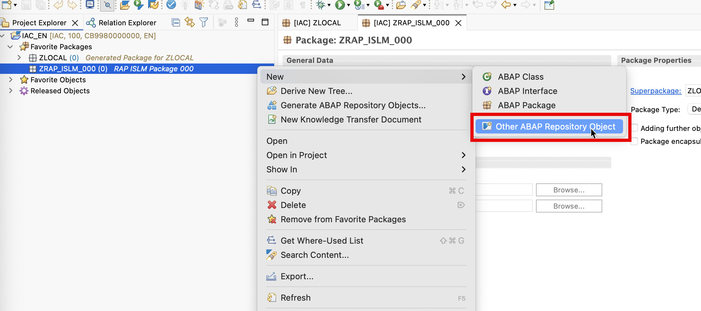

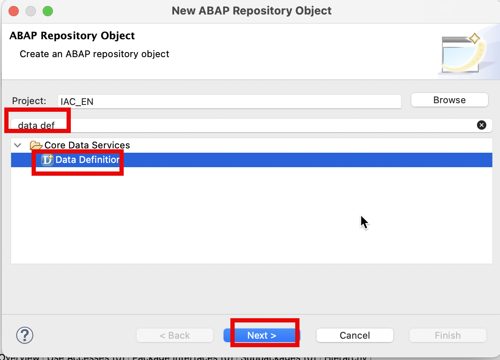

<!-- 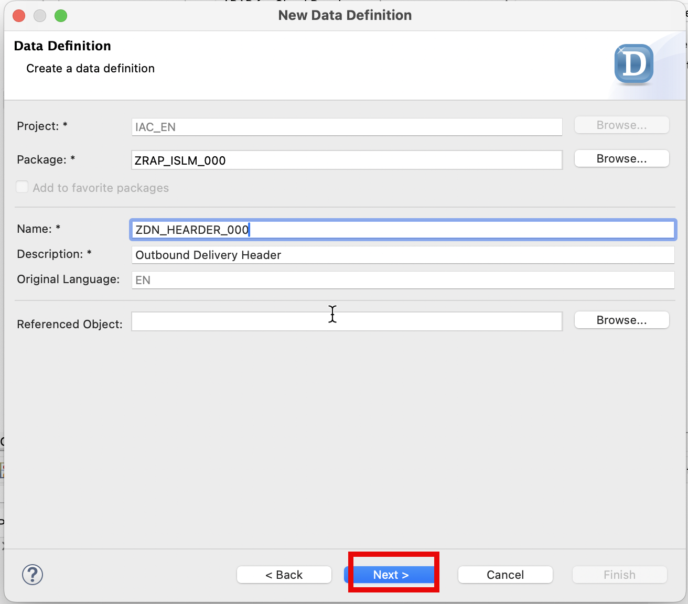 -->

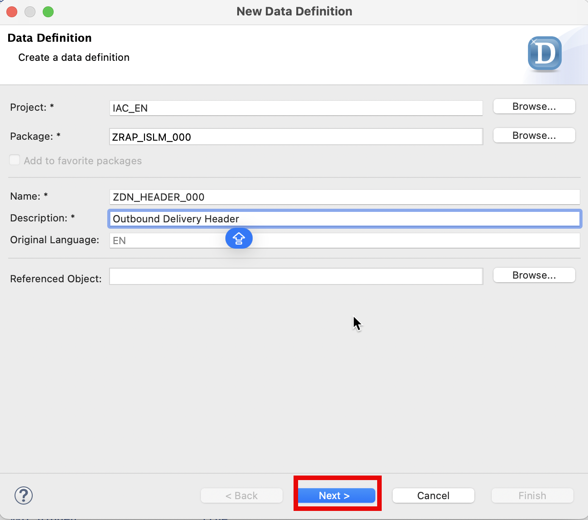

- Name: **`ZDN_HEADER_###`**
- Description: _**`Outbound Delivery Header`**_

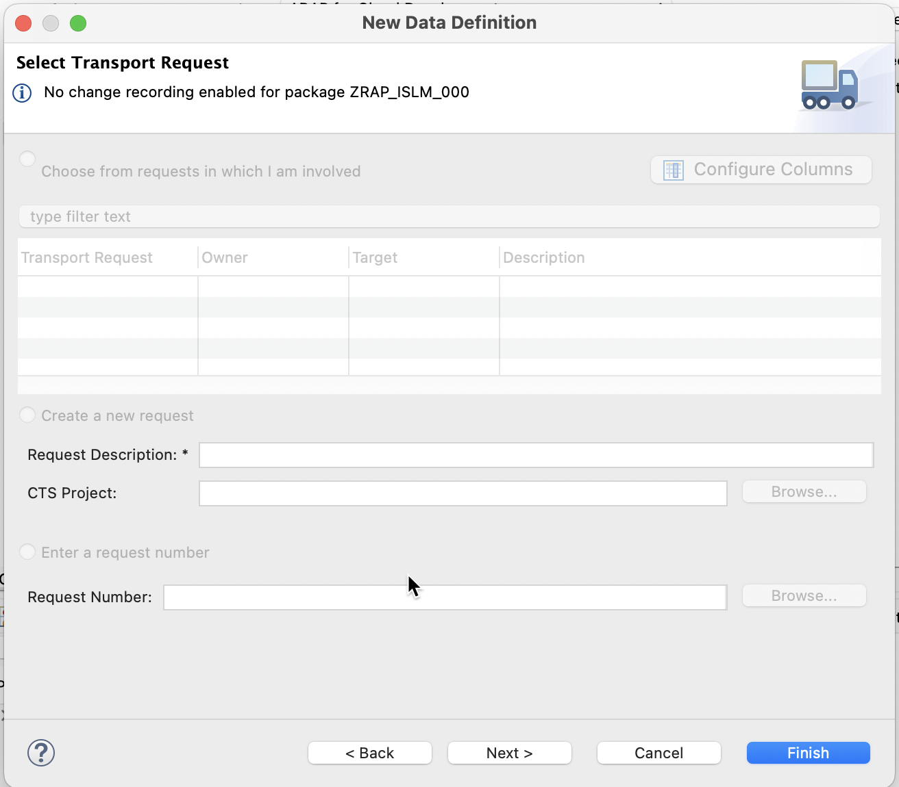

2. Click on **Finish**

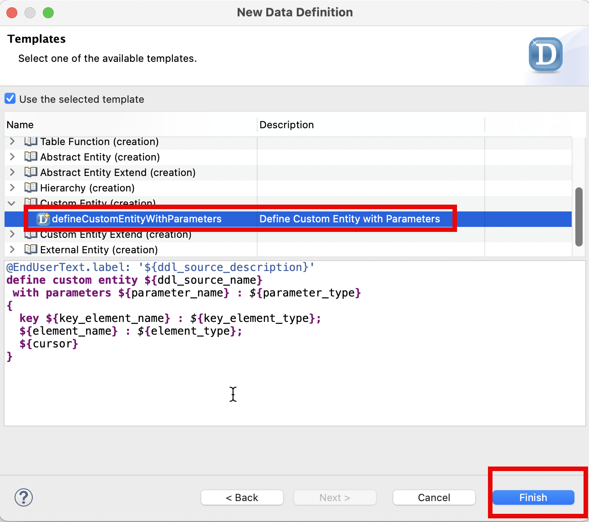

3. Select **Custom Entity(Create)**

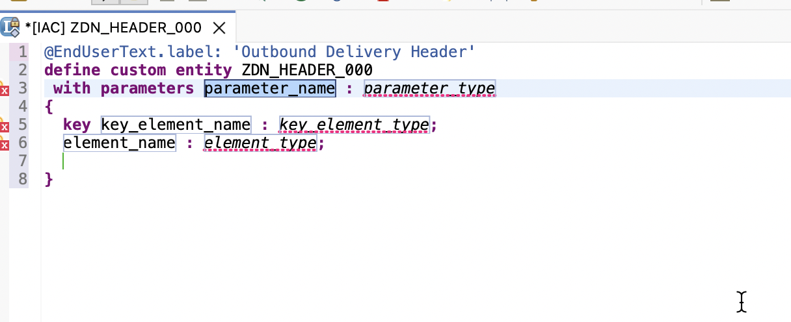

4. Please replace the code with the following code.

```
@EndUserText.label: 'Outbound Delivery Header'

@ObjectModel.query.implementedBy: 'ABAP:ZCL_DN_EXTRACT_###'
@Metadata: {
    allowExtensions: true
}
@UI.headerInfo: {
typeName: 'Outbound Delivery',
typeNamePlural: 'Outbound Deliveries',
title:{
label: 'OutboundDeliveryDocucment',
type:#STANDARD,
value:'delivery_document'},
description:{
type:#STANDARD,
label:'BillOf Lading',
value: 'bill_of_lading'} }

define root custom entity ZDN_HEADER_###
{
       //      @UI.facet                  : [{ id: 'generl',type:#COLLECTION,purpose:#STANDARD,label: 'General',targetQualifier: 'general',parentId: '',position:10,isPartOfPreview:true },
      @UI.facet                  :  [{id:'basicInfo',type:#IDENTIFICATION_REFERENCE,purpose:#STANDARD,label:'Basice Information',position:10,isPartOfPreview:true}]
//        {id                      : 'Items',type:#LINEITEM_REFERENCE,purpose:#STANDARD,position:20,label:'Outbound Delivery Items',targetElement: '_items'}]


      @UI.lineItem               : [{ position:10,label:'DeliveryDocument' }]
//      @UI.identification         : [{ position: 10,label:'DeliveryDocument' },{ type: #FOR_ACTION, dataAction: 'suggestRouteAction', label: 'Suggest The Best Route' } ]
        @UI.identification         : [{ position: 10,label:'DeliveryDocument' }]
        @UI.selectionField         : [{ position:10 }]


      key delivery_document         : abap.char(10);
      @UI.lineItem               : [{ position:20,label:'DeliveryRoute' }]
      @UI.identification         : [{ position: 20,label:'DeliveryRoute'  }]
      actual_delivery_route      : abap.char( 6 );

      @UI.lineItem               : [{ position:40,label: 'BillOfLading' }]
      @UI.identification         : [{ position: 40,label:'BillOfLading' }]
      bill_of_lading            : abap.char( 35 );

      @UI.hidden                 : true
      complete_delivery_is_defin : abap_boolean;

      @UI.lineItem               : [{ position:70,label: 'CreatedByUser' }]
      @UI.identification         : [{ position: 70,label:'CreatedByUser' }]
      created_by_user            : abap.char( 12 );

      customer_group             : abap.char(2);
      delivery_block_reason      : abap.char(2);
      @UI.lineItem               : [{ position:90,label: 'DeliverDate' }]
      @UI.identification         : [{ position: 90,label:'DeliverDate' }]
      @UI.selectionField         : [{ position:60 }]
      delivery_date              : timestampl;
      @UI.lineItem               : [{ position:100,label: 'DeliverDocumentBySuppl' }]
      @UI.identification         : [{ position: 100,label:'DeliverDocumentBySuppl' }]
      delivery_document_by_suppl : abap.char(35);
      delivery_document_type     : abap.char(4);
      delivery_is_in_plant       : abap_boolean;
      delivery_priority          : abap.char(2);

      delivery_version           : abap.char(4);
      depreciation_percentage    : abap.dec( 3, 2 );
      distr_status_by_decentrali : abap.char(1);

      etag                       : abap.string;
      external_identification_ty : abap.char(1);
      external_transport_system  : abap.char(5);
      factory_calendar_by_custom : abap.char(2);
      goods_issue_or_receipt_sli : abap.char(10);
      goods_issue_time           : abap.timn;
      handling_unit_in_stock     : abap.char(1);
      hdr_general_incompletion_s : abap.char(1);
      hdr_goods_mvt_incompletion : abap.char(1);
      header_billg_incompletion  : abap.char(1);
      header_billing_block_reaso : abap.char(2);
      header_deliv_incompletion  : abap.char(1);
      header_gross_weight        : abap.dec(11,3);
      header_net_weight          : abap.dec(11,3);
      header_packing_incompletio : abap.char(1);
      header_pickg_incompletion  : abap.char(1);
      header_volume              : abap.dec(11,3);
      header_volume_unit         : abap.char( 3 );
      header_weight_unit         : abap.char( 3 );
      incoterms_classification   : abap.char( 3 );
      incoterms_transfer_locatio : abap.char(28);

      internal_financial_documen : abap.char(10);
      is_delivery_for_single_war : abap.char(1);
      is_export_delivery         : abap.char(1);

      last_changed_by_user       : abap.char(12);

      loading_point              : abap.char(2);

      means_of_transport         : abap.char(20);
      means_of_transport_ref_mat : abap.char(40);
      means_of_transport_type    : abap.char(4);
      order_combination_is_allow : abap_boolean;
      order_id                   : abap.char(12);
      overall_deliv_conf_status  : abap.char(1);
      overall_deliv_reltd_billg  : abap.char(1);
      overall_goods_movement_sta : abap.char(1);
      overall_intco_billing_stat : abap.char(1);
      overall_packing_status     : abap.char(1);
      overall_picking_conf_statu : abap.char(1);
      overall_picking_status     : abap.char(1);
      overall_proof_of_delivery  : abap.char(1);
      overall_sdprocess_status   : abap.char(1);
      overall_warehouse_activity : abap.char(1);
      ovrl_itm_deliv_incompletio : abap.char(1);
      ovrl_itm_gds_mvt_incomplet : abap.char(1);
      ovrl_itm_general_incomplet : abap.char(1);
      ovrl_itm_packing_incomplet : abap.char(1);
      ovrl_itm_picking_incomplet : abap.char(1);
      payment_guarantee_procedur : abap.char(6);
      picked_items_location      : abap.char(20);
      proposed_delivery_route    : abap.char(6);
      receiving_plant            : abap.char(4);
      receivinglocationtimezone  : abap.char(6);
      route_schedule             : abap.char(10);
      sales_district             : abap.char(6);
      sales_office               : abap.char(4);
      @UI.lineItem               : [{ position:150,label: 'SalesOrganization' }]
      @UI.identification         : [{ position: 150,label:'SalesOrganization' }]
      @UI.selectionField         : [{ position:50 }]
      sales_organization         : abap.char(4);
      sddocument_category        : abap.char(4);

      @UI.lineItem               : [{ position:140,label: 'ShipToParty' }]
      @UI.identification         : [{ position: 140,label:'ShipToParty' }]
      @UI.selectionField         : [{ position:40 }]
      ship_to_party              : abap.char(10);
      shipment_block_reason      : abap.char(2);
      shipping_condition         : abap.char(2);
      @UI.lineItem               : [{ position:120,label: 'ShippingPoint' }]
      @UI.identification         : [{ position: 120,label:'ShippingPoint' }]
      @UI.selectionField         : [{ position:20 }]
      shipping_point             : abap.char(4);
      @UI.lineItem               : [{ position:130,label: 'ShippingType' }]
      @UI.identification         : [{ position: 130,label:'ShippingType' }]
      @UI.selectionField         : [{ position:30 }]
      shipping_type              : abap.char(2);
      sold_to_party              : abap.char(10);
      special_processing_code    : abap.char(4);
      statistics_currency        : abap.char(5);
      supplier                   : abap.char(10);
      total_block_status         : abap.char(1);
      total_credit_check_status  : abap.char(1);
      @UI.lineItem               : [{ position:110,label: 'TotalNumberOfPackage' }]
      @UI.identification         : [{ position: 110,label:'TotalNumberOfPackage' }]

      total_number_of_package    : abap.char(5);
       @UI.lineItem               : [{ position:160,label: 'TransactionCurrency' }]
      @UI.identification         : [{ position: 160,label:'TransactionCurrency' }]
      transaction_currency       : abap.char(5);
      transportation_group       : abap.char(4);
      unloading_point_name       : abap.char(25);
      warehouse                  : abap.char(3);
      warehouse_gate             : abap.char(3);
      warehouse_staging_area     : abap.char(10);
//      _items                     : composition [0..*] of ZDN_ITEM_###;
//      _partners :              composition[0..*] of zdn_address_###;

}


```

> Note: Please replace ### with your own group id.

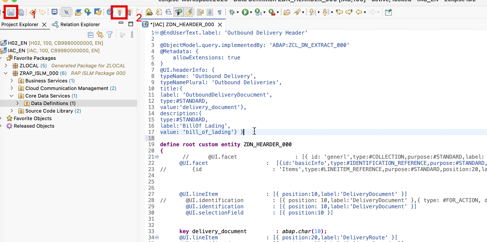

5. Please click on **Save** and **Activate** button to save and activate the customer entity.

## Create custom entity `ZDN_ITEM_###`

1. In ADT, right click **Data Definitions**, select **New Data Definition**

   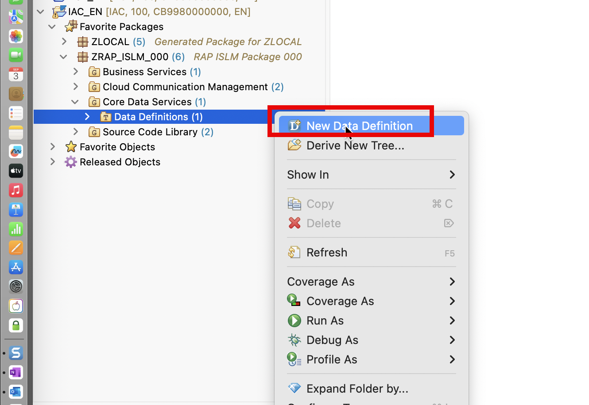

2. Provide

   - Name : `ZDN_ITEM_###`
   - Description: `Outbound Delivery Items`

   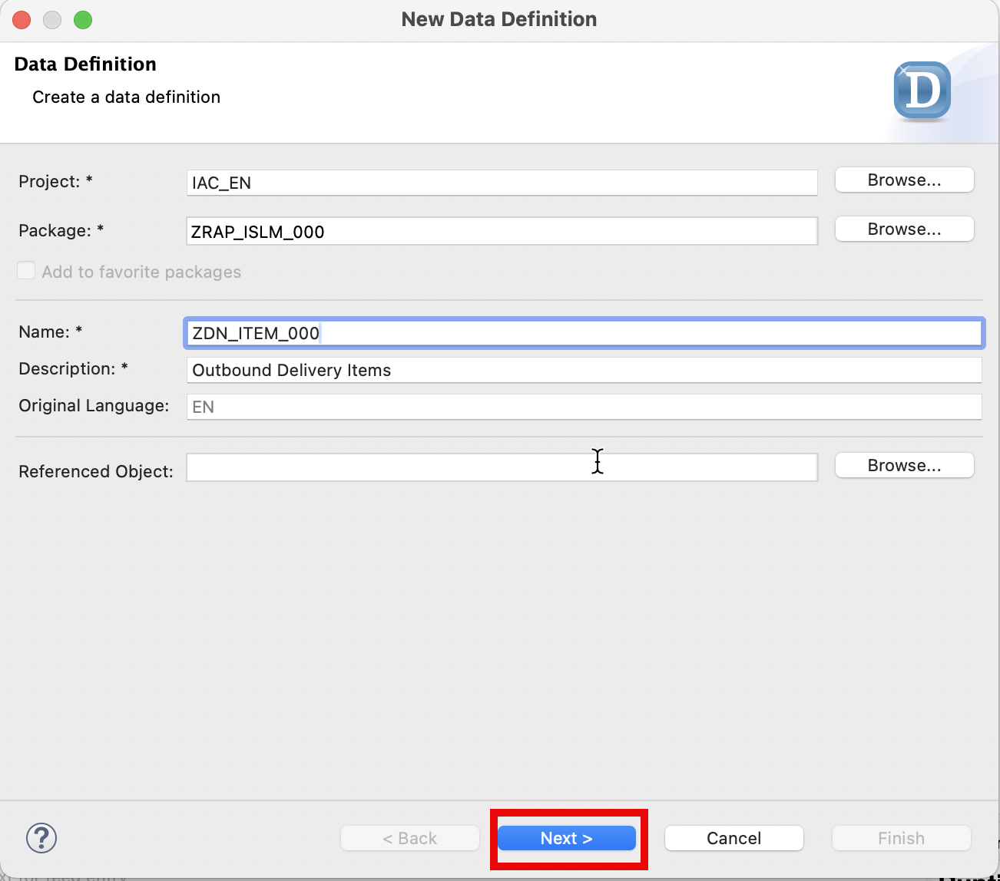

   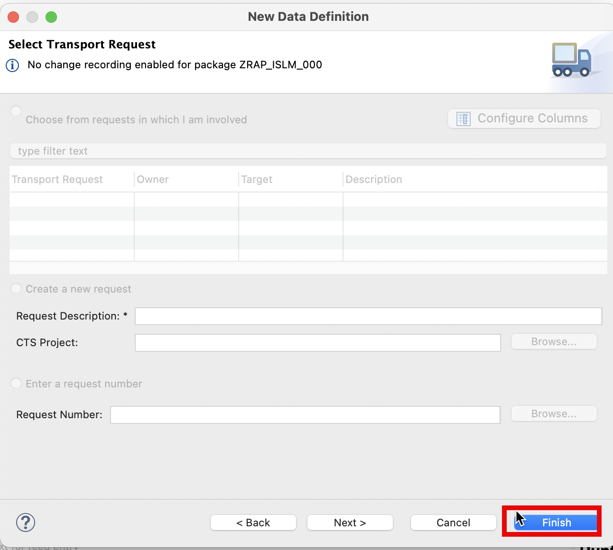

3. Click on **Finish**

   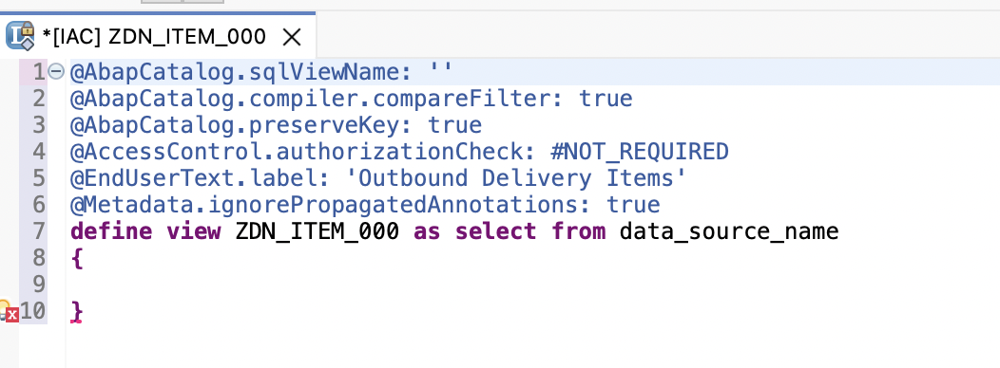

4. Replace the code of data definition `ZDN_ITEM_###` with the following code.

```

@EndUserText.label: 'ZDN_ITEM_###'
@UI.headerInfo: {
typeName: 'Outbound Delivery Item',
typeNamePlural: 'Outbound Delivery Items' ,
title:{
type: #STANDARD,
value: 'delivery_document_item'},
description:{
type:#STANDARD,
value: 'delivery_document'}}
@Metadata: {
    allowExtensions: true
}
@ObjectModel: {
    query: {
        implementedBy: 'ABAP:ZCL_DN_EXTRACT_###'
    }
}
define custom entity ZDN_ITEM_###
{


      @UI.facet                  : [{ id:'general',purpose: #STANDARD,position:10,label:'General',type:#IDENTIFICATION_REFERENCE }]
      @UI.identification:[{ position: 10,label:'DeliveryDocument' },{ type: #FOR_ACTION,dataAction: 'render',label:'Render',position:15 }]

      @UI.lineItem               :[{position: 10,label:'DeliveryDocument'}]
//      @UI.identification         : [{ position: 10,label:'DeliveryDocument' }]
  key delivery_document         : abap.char(10);
      @UI.identification         : [{ position: 20,label:'DeliveryDocumentItem' }]
      @UI.lineItem               :[{position: 20,label:'DeliveryDocumentItem'}]
  key delivery_document_item     : abap.char(6);
      @UI.lineItem               :[{position: 30,label:'ActualDelivedQuantityInBa' }]
      @UI.identification         : [{ position: 30,label:'ActualDelivedQuantityInBa' }]
//      @Semantics.quantity        : {
//      unitOfMeasure              : 'base_unit'
//  }
      actual_delivered_qty_in_ba : abap.dec(10,3);
      @UI.lineItem               :[{position: 40,label:'ActualDelivedQuantity'}]
      @UI.identification         : [{ position: 40,label:'ActualDelivedQuantity' }]
//      @Semantics.quantity        : {
//    unitOfMeasure                : 'delivery_quantity_unit'
//}
      actual_delivery_quantity   : abap.dec(10,3);
      @UI.lineItem               :[{position: 50,label:'ActualCustomerGroup'}]
      @UI.identification         : [{ position: 50,label:'ActualCustomerGroup' }]
      additional_customer_group  : abap.char(3);
      @UI.lineItem               :[{position: 60}]
      additional_customer_grou_2 : abap.char(3);
      additional_customer_grou_3 : abap.char(3);
      additional_customer_grou_4 : abap.char(3);
      additional_customer_grou_5 : abap.char(3);
      additional_material_group  : abap.char(3);
      additional_material_grou_2 : abap.char(3);
      additional_material_grou_3 : abap.char(3);
      additional_material_grou_4 : abap.char(3);
      additional_material_grou_5 : abap.char(3);
      alternate_product_number   : abap.char(40);
      @UI.lineItem               :[{position: 60,label:'BaseUnit'}]
      @UI.identification         : [{ position: 60,label:'BaseUnit' }]
//      @Semantics.unitOfMeasure   : true
      base_unit                  : abap.char(3);
      @UI.lineItem               :[{position: 70,label:'Batch'}]
      @UI.identification         : [{ position: 70,label:'Batch' }]
      batch                      : abap.char(10);
      @UI.lineItem               :[{position: 80,label:'BatchBySupplier'}]
      @UI.identification         : [{ position: 80,label:'BatchBySupplier' }]
      batch_by_supplier          : abap.char(15);
      @UI.lineItem               :[{position: 90,label:'BatchClassification'}]
      @UI.identification         : [{ position: 90,label:'BatchClassification' }]
      batch_classification       : abap.char(18);
      bomexplosion               : abap.char(8);
      business_area              : abap.char(4);
      consumption_posting        : abap.char(1);
      controlling_area           : abap.char(4);
      cost_center                : abap.char(10);
      created_by_user            : abap.char(12);
      creation_date              : timestampl;
      creation_time              : abap.timn;
      cust_engineering_chg_statu : abap.char(17);

      delivery_document_item_cat : abap.char(4);
      delivery_document_item_tex : abap.char(40);
      delivery_group             : abap.char(3);
      @UI.lineItem               :[{position: 130,label:'QuantityUnit'}]
      @UI.identification         : [{ position: 130,label:'QuantityUnit' }]
//      @Semantics.unitOfMeasure   : true
      delivery_quantity_unit     :abap.char(3);
      delivery_related_billing_s : abap.char(1);
      delivery_to_base_quantity  : abap.dec(3,0);
      delivery_to_base_quantit_2 : abap.dec(3,0);
      delivery_version           : abap.char(4);
      department_classification  : abap.char(4);
      distribution_channel       : abap.char(2);
      division                   : abap.char(2);
      eudelivery_item_arcstatus  : abap.char(1);
      fixed_shipg_procg_duration : abap.dec(3,2);
      glaccount                  : abap.char(10);
      goods_movement_reason_code : abap.char(4);
      goods_movement_status      : abap.char(1);
      goods_movement_type        : abap.char(3);
      higher_lvl_itm_of_bat_splt : abap.char(6);
      higher_level_item          : abap.char(6);
      inspection_lot             : abap.char(12);
      inspection_partial_lot     : abap.char(6);
      intercompany_billing_statu : abap.char(1);
      international_article_numb : abap.char(18);
      inventory_special_stock_ty : abap.char(1);
      inventory_valuation_type   : abap.char(10);
      is_completely_delivered    : abap_boolean;
      is_not_goods_movements_rel : abap.char(1);
      is_separate_valuation      : abap_boolean;
      issg_or_rcvg_batch         : abap.char(10);
      issg_or_rcvg_material      : abap.char(40);
      issg_or_rcvg_spcl_stock_in : abap.char(1);
      issg_or_rcvg_stock_categor : abap.char(1);
      issg_or_rcvg_valuation_typ : abap.char(10);
      issuing_or_receiving_plant : abap.char(4);
      issuing_or_receiving_stora : abap.char(4);
      item_billing_block_reason  : abap.char(2);
      item_billing_incompletion  : abap.char(1);
      item_delivery_incompletion : abap.char(1);
      item_gds_mvt_incompletion  : abap.char(1);
      item_general_incompletion  : abap.char(1);
      item_gross_weight          : abap.dec(11,3);
      item_is_billing_relevant   : abap.char(1);
      item_net_weight            : abap.dec(11,3);
      item_packing_incompletion  : abap.char(1);
      item_picking_incompletion  : abap.char(1);
      item_volume                : abap.dec(11,3);
      item_volume_unit           : abap.char(3);
      item_weight_unit           : abap.char(3);
      last_change_date           : timestampl;
      loading_group              : abap.char(4);
      manufacture_date           : timestampl;
      @UI.lineItem               :[{position: 100,label:'Material'}]
      @UI.identification         : [{ position: 100,label:'Material' }]
      material                   : abap.char(40);
      material_by_customer       : abap.char(35);
      material_freight_group     : abap.char(8);
      material_group             : abap.char(9);
      material_is_batch_managed  : abap_boolean;

      material_is_int_batch_mana : abap_boolean;
      @UI.lineItem               :[{position: 110,label:'NumberOfSerialNumbers'}]
      @UI.identification         : [{ position: 110,label:'NumberOfSerialNumbers' }]
      number_of_serial_numbers   : abap.int4;
      order_id                   : abap.char(12);
      order_item                 : abap.char(4);
      original_delivery_quantity : abap.dec(10,3);
      originally_requested_mater : abap.char(40);
      overdeliv_tolrtd_lmt_ratio : abap.dec(2,1);
      packing_status             : abap.char(1);
      partial_delivery_is_allowe : abap.char(1);
      payment_guarantee_form     : abap.char(2);
      picking_confirmation_statu : abap.char(1);
      picking_control            : abap.char(1);
      picking_status             : abap.char(1);
      @UI.lineItem               :[{position: 120,label:'Plant'}]
      @UI.identification         : [{ position: 120,label:'Plant' }]
      plant                      : abap.char(4);
      primary_posting_switch     : abap.char(1);
      product_availability_date  : timestampl;
      product_availability_time  : abap.timn;
      product_configuration      : abap.char(18);
      product_hierarchy_node     : abap.char(18);
      profitability_segment      : abap.char(10);
      profit_center              : abap.char(10);
      proof_of_delivery_relevanc : abap.char(1);
      proof_of_delivery_status   : abap.char(1);
      quantity_is_fixed          : abap_boolean;
      receiving_point            : abap.char(25);
      reference_document_logical : abap.char(10);
      reference_sddocument       : abap.char(10);
      reference_sddocument_categ : abap.char(4);
      reference_sddocument_item  : abap.char(6);
      retail_promotion           : abap.char(10);
      sales_document_item_type   : abap.char(1);
      sales_group                : abap.char(3);
      sales_office               : abap.char(4);
      sddocument_category        : abap.char(4);
      sdprocess_status           : abap.char(1);
      shelf_life_expiration_date : timestampl;
      statistics_date            : timestampl;
      stock_type                 : abap.char(1);
      storage_bin                : abap.char(10);
      storage_location           : abap.char(4);
      storage_type               : abap.char(3);
      subsequent_movement_type   : abap.char(3);
      transportation_group       : abap.char(4);
      underdeliv_tolrtd_lmt_rati : abap.dec(2,1);
      unlimited_overdelivery_is  : abap_boolean;
      varbl_shipg_procg_duration : abap.dec(3,2);
      warehouse                  : abap.char(3);
      warehouse_activity_status  : abap.char(1);
      warehouse_staging_area     : abap.char(10);
      warehouse_stock_category   : abap.char(1);
      warehouse_storage_bin      : abap.char(10);
      _headers                   : association to parent zdn_header_000 on $projection.delivery_document = _headers.delivery_document;


}


```

> please replace the '###' with your group id .

4. Please click on **Save** and **Activate** button to save and activate the custom entity.

## Create custom entity `ZDN_ADDRESS_###`

1. In ADT, right click **Data Definitions**, select **New Data Definition**

   

2. Provide

   - Name : `ZDN_ADDRESS_###`
   - Description: `Outbound Delivery Address`

   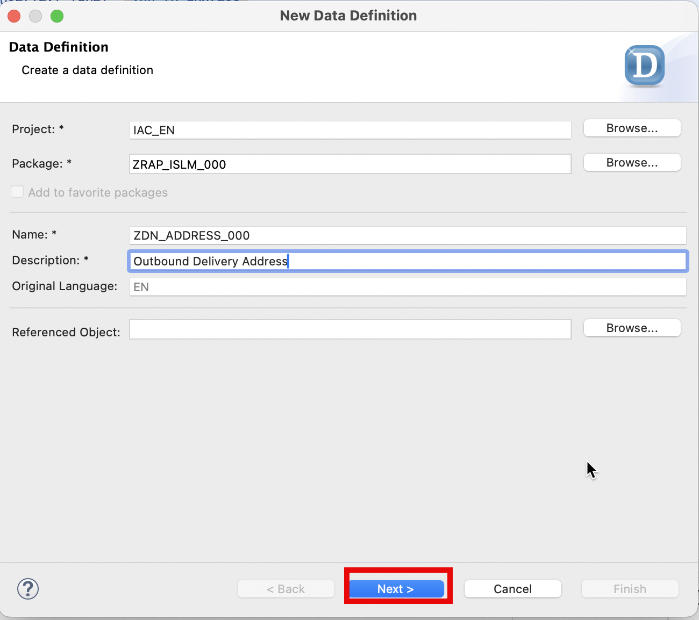

   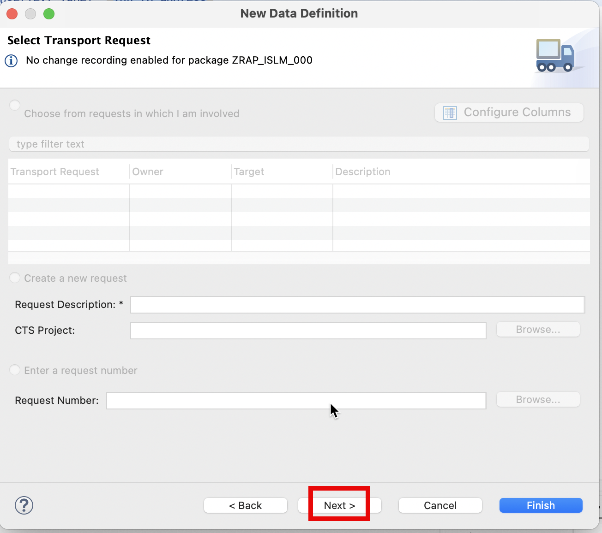

   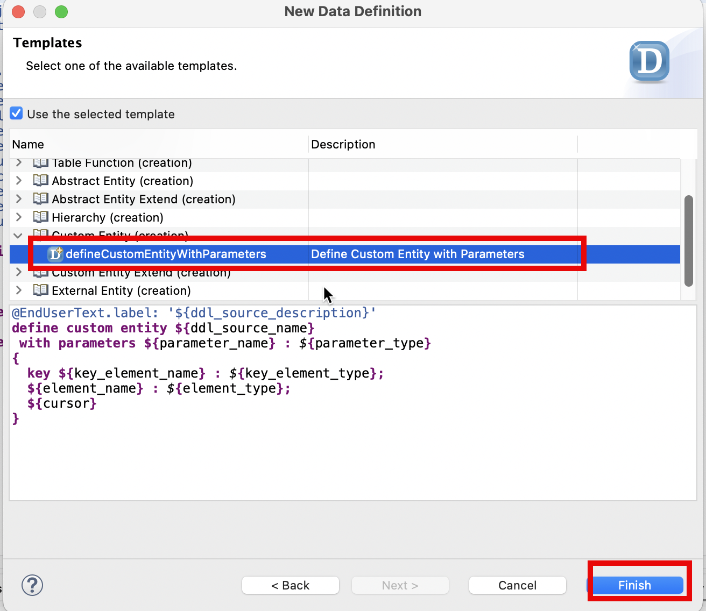

3. Click on **Finish**

   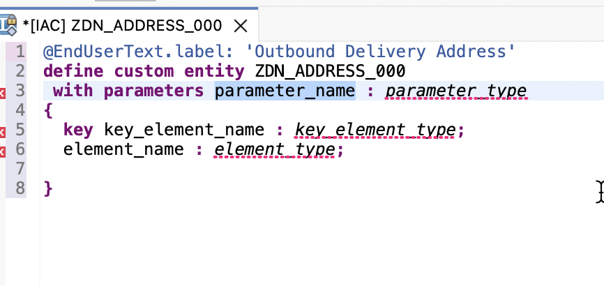

4. Replace the code of data definition `ZDN_ADDRESS_###` with the following code.

```
@EndUserText.label: 'Outbound Delivery Address'

@ObjectModel.query.implementedBy: 'ABAP:ZCL_DN_EXTRACT_###'
@Metadata: {
    allowExtensions: true
}
@UI.headerInfo: {
typeName: 'Ship To Partner Address',
typeNamePlural: 'Ship To Partner Addresses',
title:{
label: 'OutboundDeliveryDocucment',
type:#STANDARD,
value:'delivery_document'},
description:{
type:#STANDARD,
label:'Partner Function',
value: 'partner_function'} }


define custom entity ZDN_ADDRESS_###
{
 key delivery_document          : abap.char( 10 );

  key partner_function           : abap.char(2);

      delivery_version           : abap.char(4);

      additional_street_prefix_n : abap.char(40);

      address_id                 : abap.char(10);

      additional_street_suffix_n : abap.char(40);

      address_time_zone          : abap.char(6);

      building                   : abap.char(20);

      business_partner_name_1    : abap.char(40);

      business_partner_name_2    : abap.char( 40 );

      business_partner_name_3    : abap.char( 40 );

      business_partner_name_4    : abap.char( 40 );

      person_family_name         : abap.char( 40 );

      person_given_name          : abap.char( 40 );

      care_of_name               : abap.char( 40 );

      city_name                  : abap.char( 40 );

      company_postal_code        : abap.char( 10 );

      correspondence_language    : abap.char( 2 );

      country                    : abap.char( 3 );

      county                     : abap.char( 40 );

      delivery_service_number    : abap.char( 10 );

      delivery_service_type_code : abap.char( 4 );

      district                   : abap.char( 40 );

      email_address              : abap.char( 241 );

      fax_number                 : abap.char( 30 );

      fax_number_extension       : abap.char( 10 );

      floor                      : abap.char( 10 );

      form_of_address            : abap.char( 4 );

      home_city_name             : abap.char( 40 );

      house_number               : abap.char( 10 );

      house_number_supplement_te : abap.char( 10 );

      mobile_phone_number        : abap.char( 30 );

      phone_number               : abap.char( 30 );

      phone_number_extension     : abap.char( 10 );

      pobox                      : abap.char( 10 );

      pobox_deviating_city_name  : abap.char( 40 );

      pobox_deviating_country    : abap.char( 3 );

      pobox_deviating_region     : abap.char( 3 );

      pobox_is_without_number    : abap_boolean;

      pobox_lobby_name           : abap.char( 40 );

      pobox_postal_code          : abap.char( 10 );

      postal_code                : abap.char( 10 );

      prfrd_comm_medium_type     : abap.char( 3 );

      region                     : abap.char( 3 );

      room_number                : abap.char( 10 );

      street_name                : abap.char( 60 );

      street_prefix_name         : abap.char( 40 );

      street_suffix_name         : abap.char( 40 );

      tax_jurisdiction           : abap.char( 15 );

      transport_zone             : abap.char( 10 );

      _header:  association to parent ZDN_HEADER_### on $projection.delivery_document = _header.delivery_document;


}

```

> Note: Please replace ### with your own group id.

5. Please click on **Save** and **Activate** button to save and activate the custom entity.

6. Re-activate the custom entity `ZDN_HEARDER_###`

   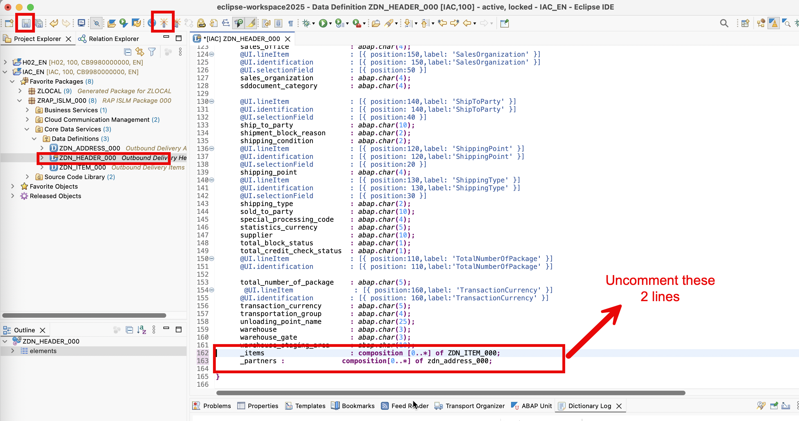

7. Then click on **Save** and **Activate** button to save and activate the custom entity.

## Create abastract entity `ZISLM_RESULT_###`

1. In Eclipse ADT, right click **Data Definitions** and select **New Data Definition** .

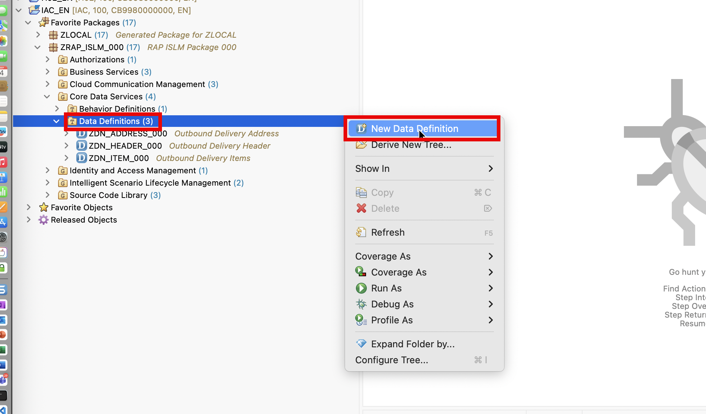


<!--  -->

<!--  -->

- Name: **`ZISLM_RESULT_###`**
- Description: _**`Result From AI Core`**_

2. Click on **Next**


2. Click on **Next**

<!--  -->


3. Select **Custom Entity(Create)**

<!--  -->


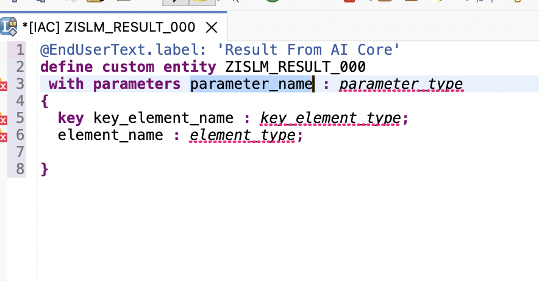

4.  Please replace the code with the following code.

        ```
        @EndUserText.label: 'Result From AI Core'
        define abstract entity ZISLM_RESULT_000
        {
        shipItemInfo : abap.string( 0 );
        shipFromInfo : abap.string( 0 );
        shipToInfo : abap.string( 0 );
        routInfo : abap.string( 0 );
        }

        ```

    > Note: Please replace ### with your own group id.

    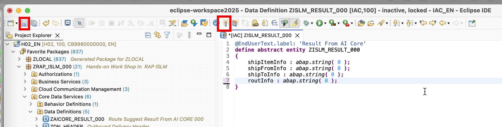

5.  Then click on **Save** and **Activate** button to save and activate the abstract entity.

## Create abastract entity `ZISLM_AICORE_ROUTE_###`

1. In Eclipse ADT, right click **Data Definitions** and select **New Data Definition**.

   
   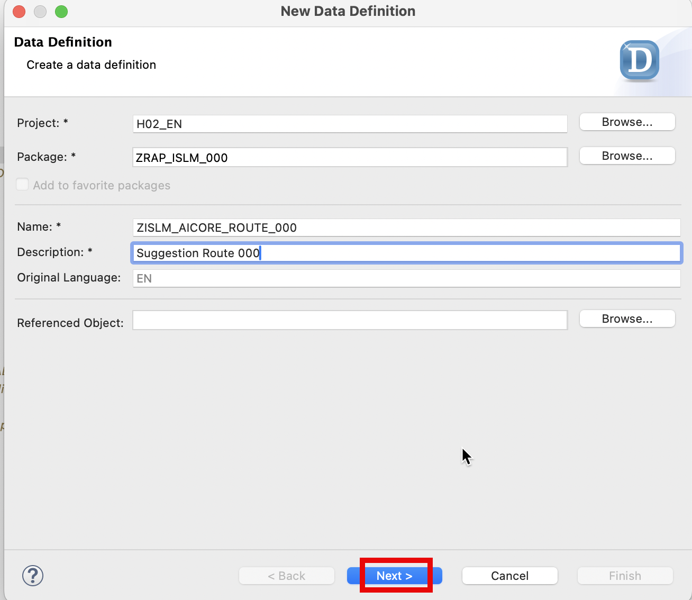

   - Name: **`ZISLM_AICORE_ROUTE_###`**
   - Description: _**`Suggestion Route ###`**_

2. Click on **Next**

   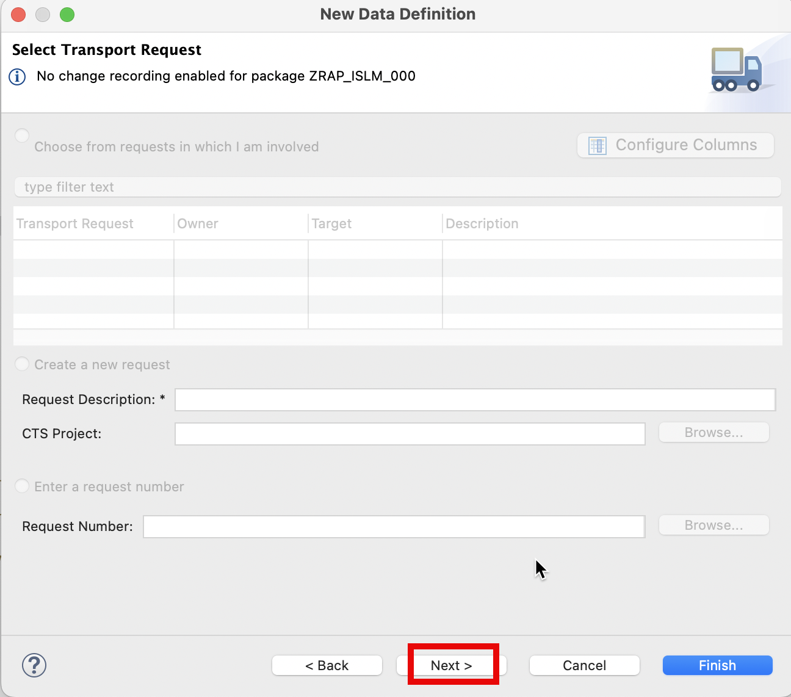

3. Click on **Next**

   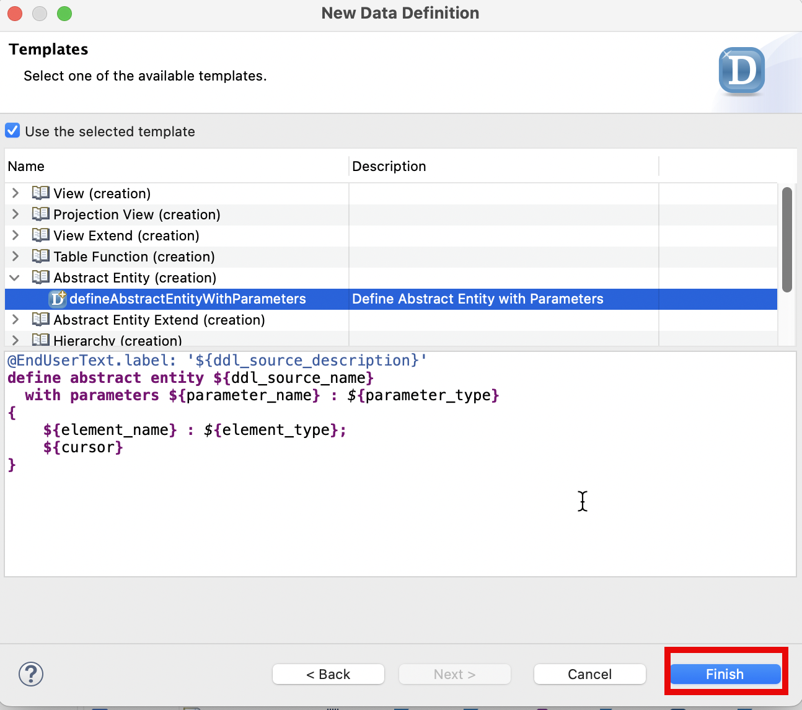

4. Click on **Finish**

5. Replace the code with the following code.

   ```
   @EndUserText.label: 'Suggestion Route ###'
   define abstract entity ZISLM_AICORE_ROUTE_###
   {
           routInfo : abap.string( 0 );

   }
   ```

   > Note: Please replace ### with your own group id.

   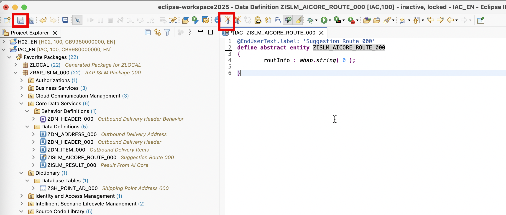

6. Then click on **Save** and **Activate** button to save and activate the abstract entity.
