## Create **Service Definition**

1. In ADT, Right click Package: `ZRAP_ISLM_###` and choose **New** > **Other ABAP Repository Object**:

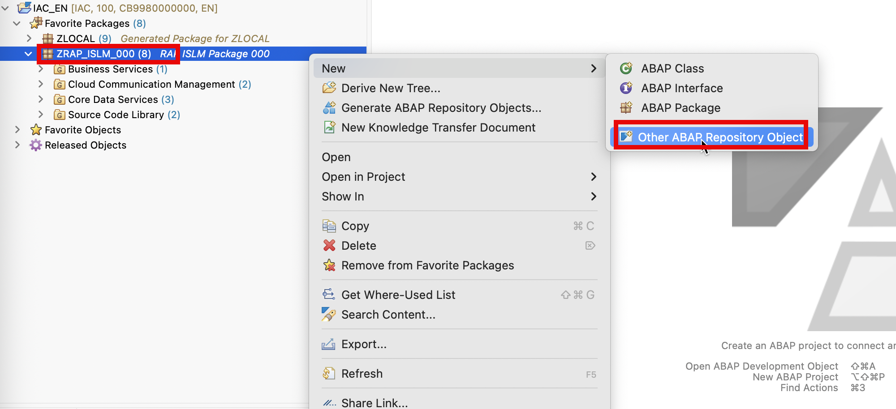

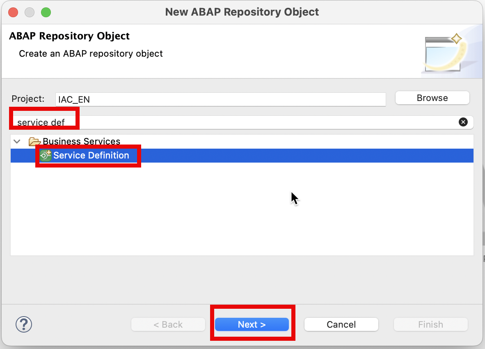

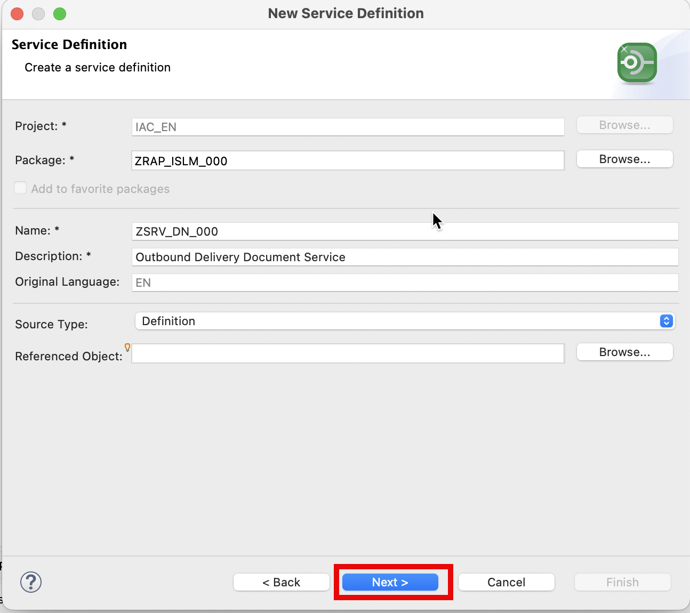

- Name: `ZSRV_DN_###`

- Description: `Outbound Delivery Document Service`

- Source Type: `Definition`

Click on **Next**

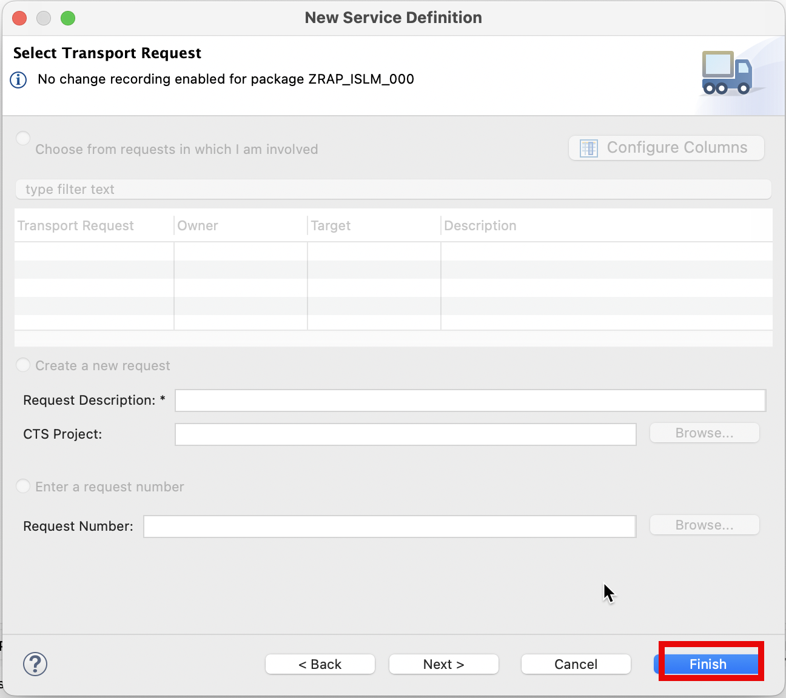

Click on **Finish**

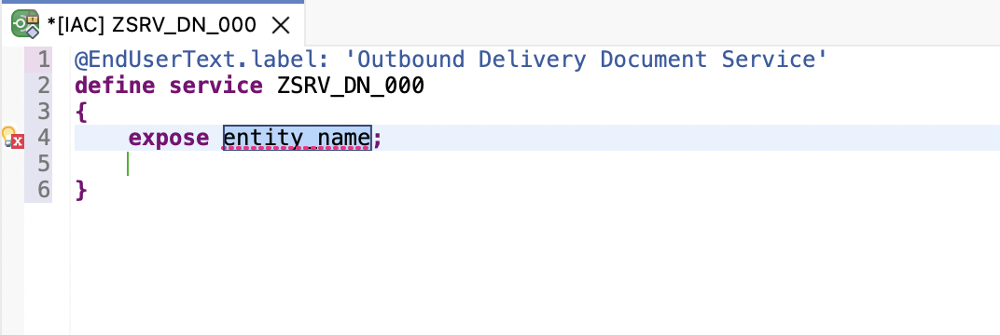

2. Expose the entities in Service Definition.

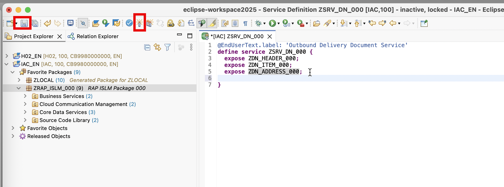

```
@EndUserText.label: 'Outbound Delivery Document Service'
define service ZSRV_DN_### {
  expose ZDN_HEADER_###;
  expose ZDN_ITEM_###;
  expose ZDN_ADDRESS_###;
}

```

> please replace the '###' with your group id .

Please click on **Save** and **Activate** button to save and activate the service definitions.

## Create **Service Binding**

1. In ADT, Right click **Service Definition**: `ZSRV_DN_###` and choose **New Service Binding**

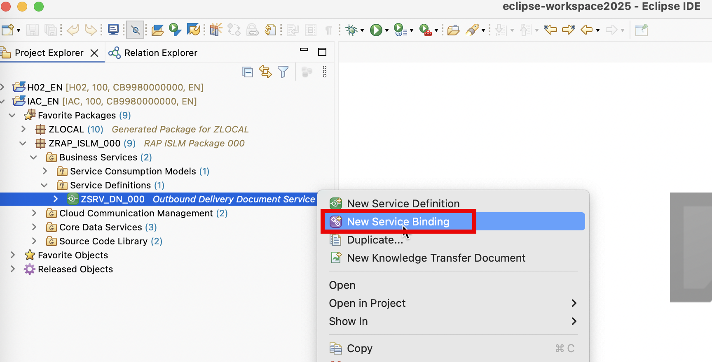

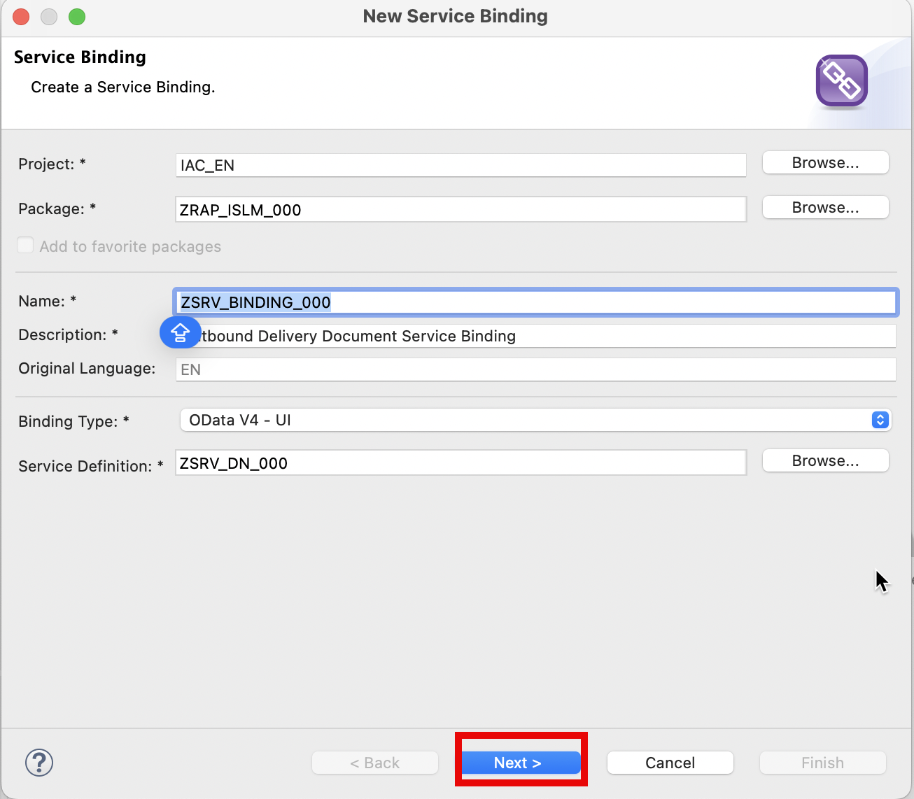

- Name: `ZSRV_BINDING_###`

- Description: `Outbound Delivery Document Service Binding`

- Binding Type: `Odata V4 - UI`

- Service Definition: `ZSRV_DN_###`

Click on **Next**

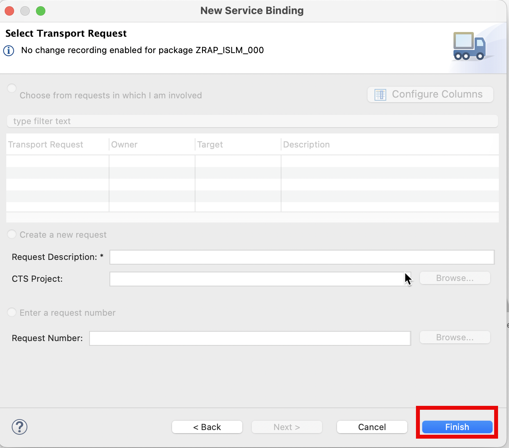

Click on **Finish**

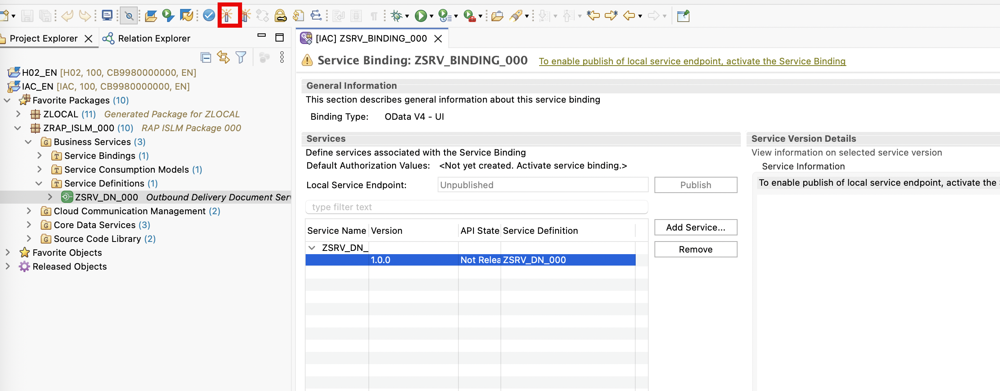

Click on **Activate**

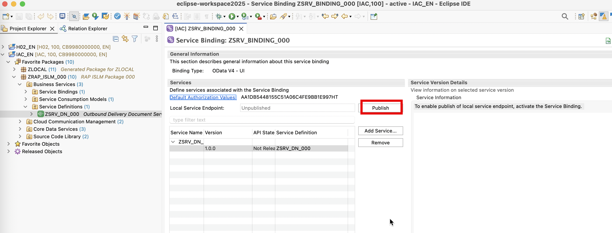

Click on **Publish**

## Preview **Service Binding**

In ADT, double click Service Binding `ZSRV_BINDING_###`

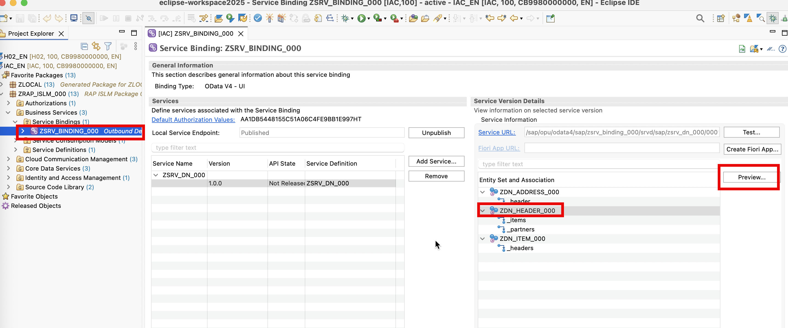

Click on **Preview**

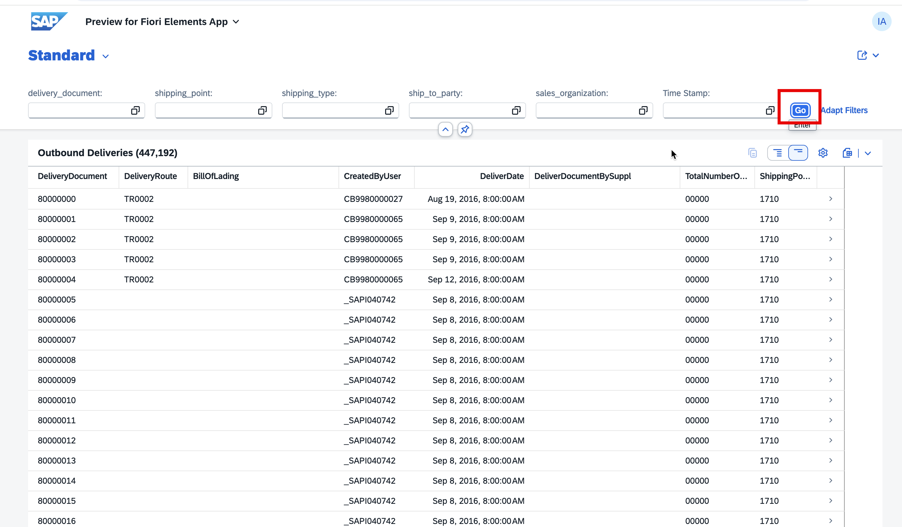
