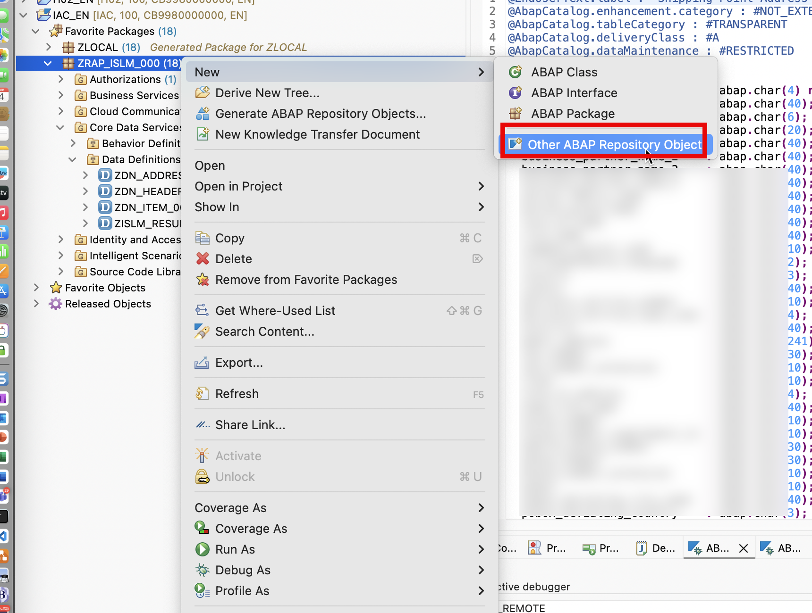
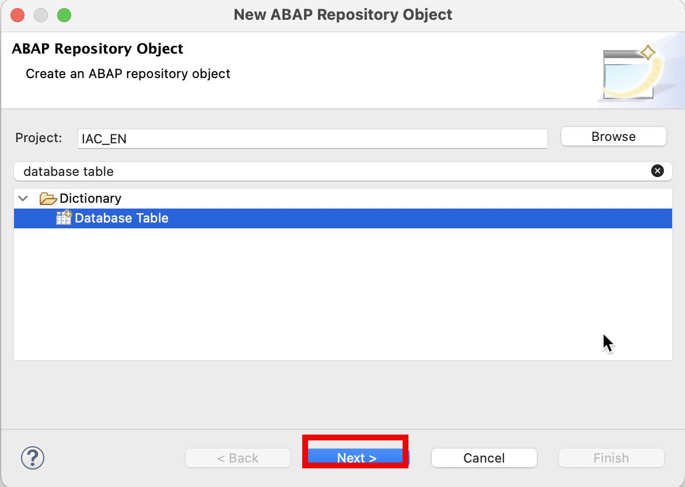
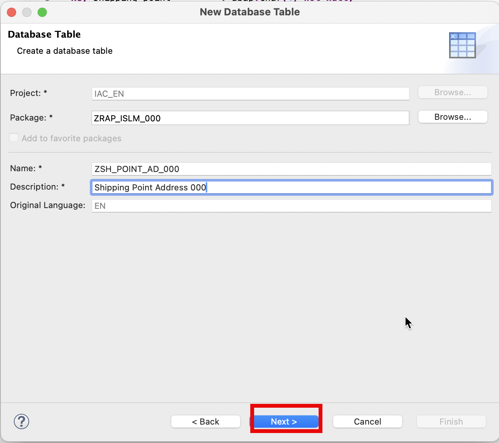
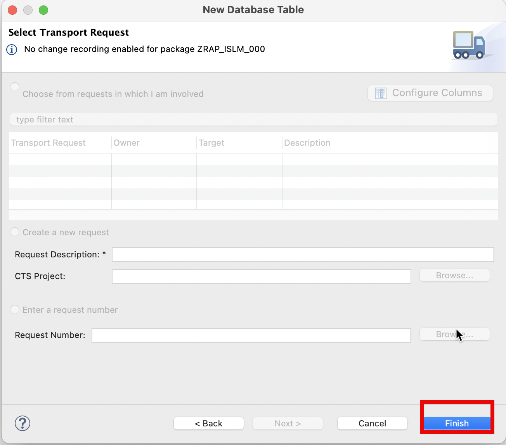
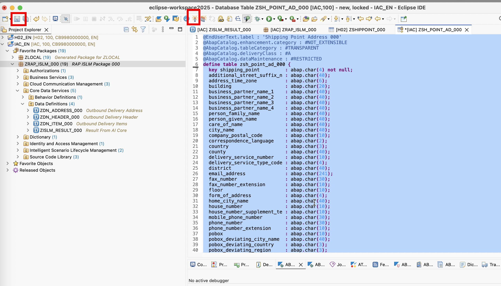
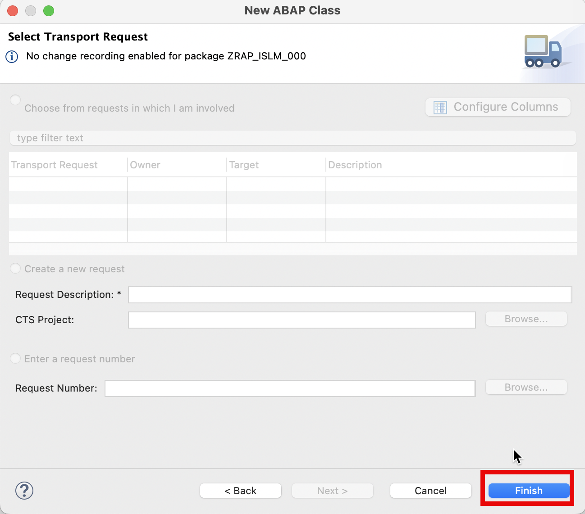
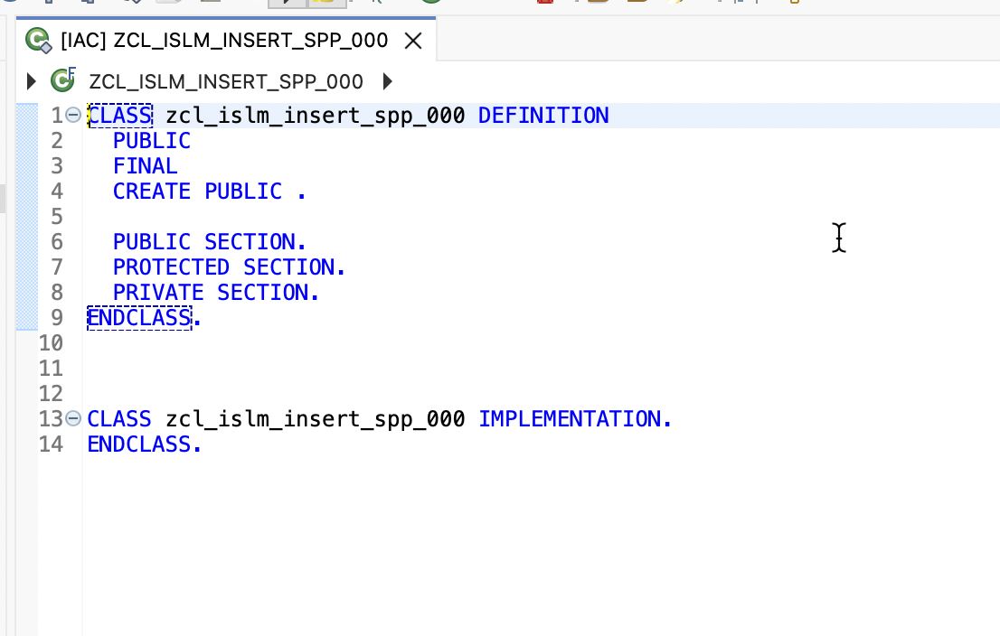
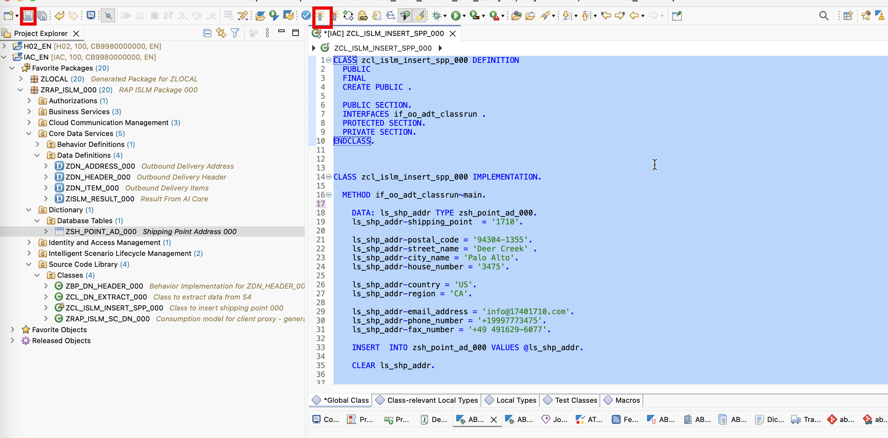
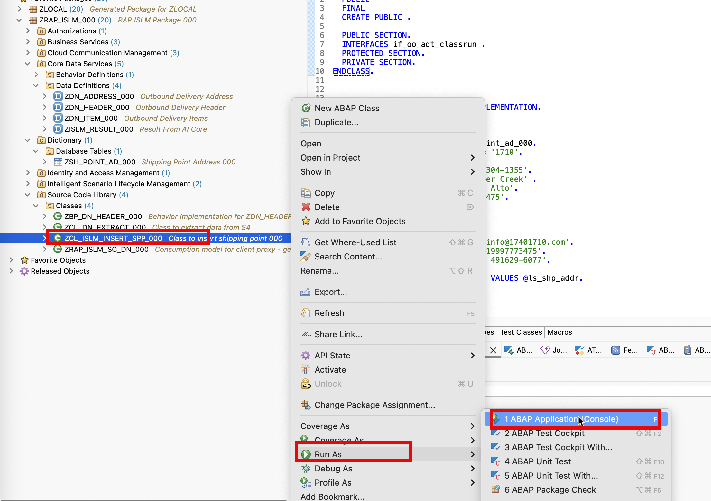

## Create Table for shipping point.

In this exercise, we will create a DB table to store shipping point address data. And we will create a class to insert data into the table.

## Procedure

1. Right-click on your ABAP package `ZRAP_ISLM_###` and select **New** > **Other ABAP Repository Object** from the context menu.
   

2. Search for `database table`, select it, and click **Next>**.
   

3. Maintain the required information (### is your group ID) and click **Next>**.

   

   - Name: `ZSH_POINT_AD_###`
   - Description: `Shipping Point Address`

4. Click on **Next>**

   

5. Click on **Finish**

6. Replace the table code with the following code:

   ```
   @EndUserText.label : 'Shipping Point Address ###'
   @AbapCatalog.enhancement.category : #NOT_EXTENSIBLE
   @AbapCatalog.tableCategory : #TRANSPARENT
   @AbapCatalog.deliveryClass : #A
   @AbapCatalog.dataMaintenance : #RESTRICTED
   define table zsh_point_ad_### {
   key shipping_point         : abap.char(4) not null;
   additional_street_suffix_n : abap.char(40);
   address_time_zone          : abap.char(6);
   building                   : abap.char(20);
   business_partner_name_1    : abap.char(40);
   business_partner_name_2    : abap.char(40);
   business_partner_name_3    : abap.char(40);
   business_partner_name_4    : abap.char(40);
   person_family_name         : abap.char(40);
   person_given_name          : abap.char(40);
   care_of_name               : abap.char(40);
   city_name                  : abap.char(40);
   company_postal_code        : abap.char(10);
   correspondence_language    : abap.char(2);
   country                    : abap.char(3);
   county                     : abap.char(40);
   delivery_service_number    : abap.char(10);
   delivery_service_type_code : abap.char(4);
   district                   : abap.char(40);
   email_address              : abap.char(241);
   fax_number                 : abap.char(30);
   fax_number_extension       : abap.char(10);
   floor                      : abap.char(10);
   form_of_address            : abap.char(4);
   home_city_name             : abap.char(40);
   house_number               : abap.char(10);
   house_number_supplement_te : abap.char(10);
   mobile_phone_number        : abap.char(30);
   phone_number               : abap.char(30);
   phone_number_extension     : abap.char(10);
   pobox                      : abap.char(10);
   pobox_deviating_city_name  : abap.char(40);
   pobox_deviating_country    : abap.char(3);
   pobox_deviating_region     : abap.char(3);
   pobox_is_without_number    : abap.char(1);
   pobox_lobby_name           : abap.char(40);
   pobox_postal_code          : abap.char(10);
   postal_code                : abap.char(10);
   prfrd_comm_medium_type     : abap.char(3);
   region                     : abap.char(3);
   room_number                : abap.char(10);
   street_name                : abap.char(60);
   street_prefix_name         : abap.char(40);
   street_suffix_name         : abap.char(40);
   tax_jurisdiction           : abap.char(15);
   transport_zone             : abap.char(10);

   }
   ```

   > please replace the '###' with your group id .

   

7. Click on **Save** and **Activate**

## Create Class to insert shipping point records.

1. Right-click on your ABAP package `ZRAP_ISLM_###` and select **New** > **ABAP Class** from the context menu.

   

2. Provide

   - Name: `ZCL_ISLM_INSERT_SPP_###`
   - Description: `Class to insert shipping point ###`

   

3. Click button **Finish**

   

   

4. Replace the class code with the following code.

> Notes: If you use your own S/4 system, please insert your own actual shipping point address data.

```

CLASS zcl_islm_insert_spp_### DEFINITION
PUBLIC
FINAL
CREATE PUBLIC .

PUBLIC SECTION.
INTERFACES if_oo_adt_classrun .
PROTECTED SECTION.
PRIVATE SECTION.
ENDCLASS.


CLASS zcl_islm_insert_spp_### IMPLEMENTATION.

METHOD if_oo_adt_classrun~main.

    DATA: ls_shp_addr TYPE zsh_point_ad_###.
    ls_shp_addr-shipping_point  = '1710'.

    ls_shp_addr-postal_code = '94304-1355'.
    ls_shp_addr-street_name = 'Deer Creek' .
    ls_shp_addr-city_name = 'Palo Alto'.
    ls_shp_addr-house_number = '3475'.

    ls_shp_addr-country = 'US'.
    ls_shp_addr-region = 'CA'.

    ls_shp_addr-email_address = 'info@17401710.com'.
    ls_shp_addr-phone_number = '+19997773475'.
    ls_shp_addr-fax_number = '+49 491629-6077'.

    INSERT  INTO zsh_point_ad_### VALUES @ls_shp_addr.

    CLEAR ls_shp_addr.

ENDMETHOD.

ENDCLASS.

```

> please replace the '###' with your group id .



5. Click on **Save** and **Activate**.

   

6. Right click class `ZCL_ISLM_INSERT_SPP_###`, Select **Run As**> **ABAP Application(Console)**
