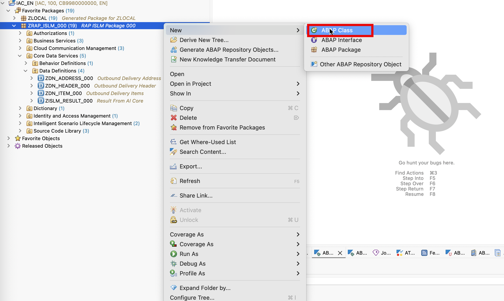
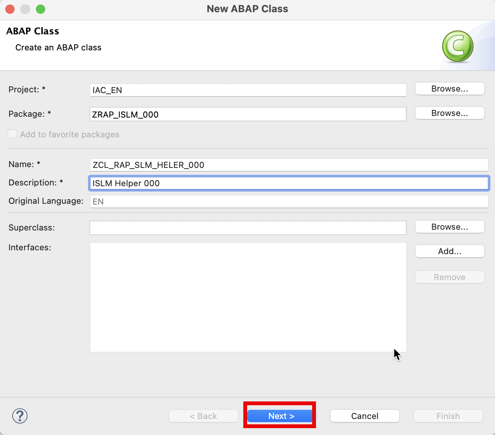
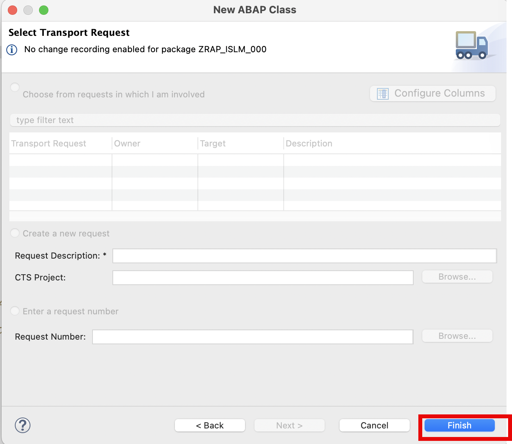
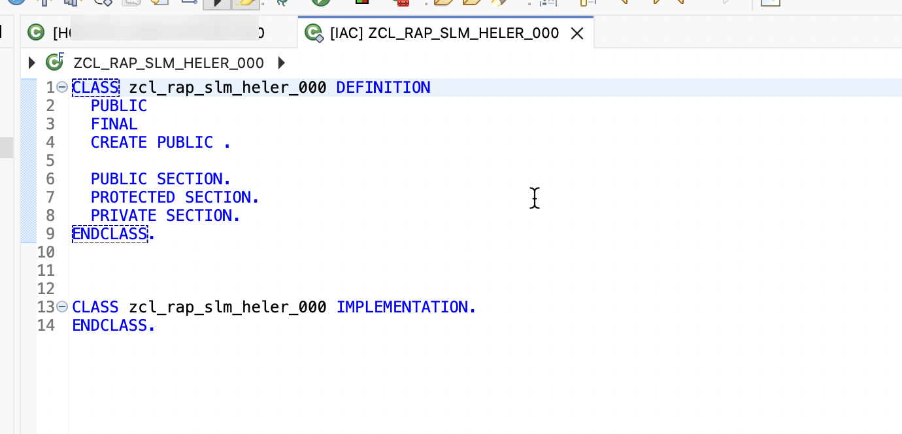
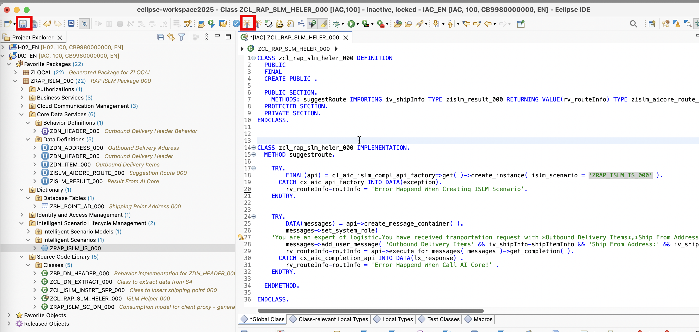

## Create ISLM helper Class in Eclipse ADT.

1. Right-click on your ABAP package `ZRAP_ISLM_###` and select **New** > **ABAP Class** from the context menu.

   

2. Provide

   - Name: `ZCL_RAP_SLM_HELER_###`
   - Description: `ISLM Helper ###`

   

3. Click button **Next**

   

4. Click button **Finish**

   

5. Replace the class code with the following code.

   ```
   CLASS zcl_rap_slm_heler_### DEFINITION
   PUBLIC
   FINAL
   CREATE PUBLIC .

    PUBLIC SECTION.
    METHODS: suggestRoute IMPORTING iv*shipInfo TYPE zislm_result*### RETURNING VALUE(rv*routeInfo) TYPE zislm_aicore_route*### .
    PROTECTED SECTION.
    PRIVATE SECTION.
    ENDCLASS.

    CLASS zcl*rap_slm_heler*### IMPLEMENTATION.
    METHOD suggestroute.

    TRY.
        FINAL(api) = cl_aic_islm_compl_api_factory=>get( )->create_instance( islm_scenario = 'ZRAP_ISLM_IS_###' ).
    CATCH cx_aic_api_factory INTO DATA(exception).
        rv_routeInfo-routInfo = 'Error Happend When Creating ISLM Scenario'.

    ENDTRY.
    TRY.
        DATA(messages) = api->create_message_container( ).
        messages->set_system_role(
    'You are an expert of logistic.You have received tranportation request with *Outbound Delivery Items*,*Ship From Address*,*Ship To Address*.They are in XML format. The user need you to suggest a best route for the Transportation request.').
        messages->add_user_message( 'Outbound Delivery Items' && iv_shipInfo-shipItemInfo && 'Ship From Address:' && iv_shipInfo-shipFromInfo && 'Ship To Address:' && iv_shipInfo-shipToInfo ).
        rv_routeInfo-routInfo = api->execute_for_messages( messages )->get_completion( ).
    CATCH cx_aic_completion_api INTO DATA(lx_response) .
        rv_routeInfo-routInfo = 'Error Happend When Call AI Core!' .
    ENDTRY.

    ENDMETHOD.

    ENDCLASS.
   ```

   > please replace the '###' with your group id .

   

6. Click on **Save** and **Activate**.
