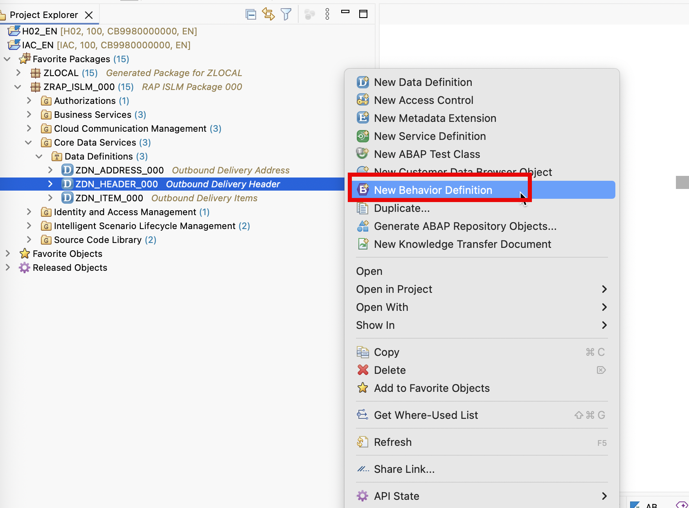
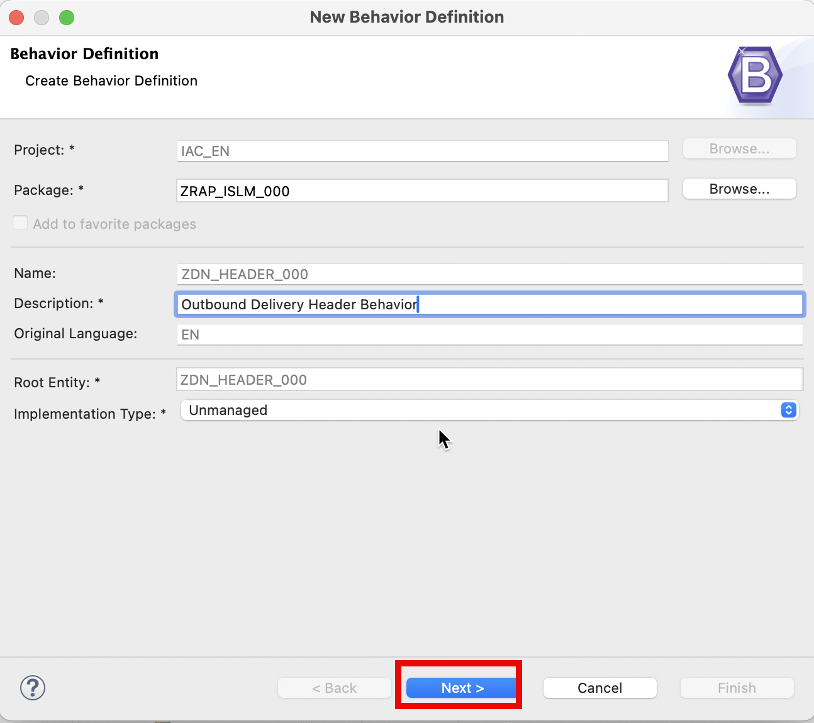
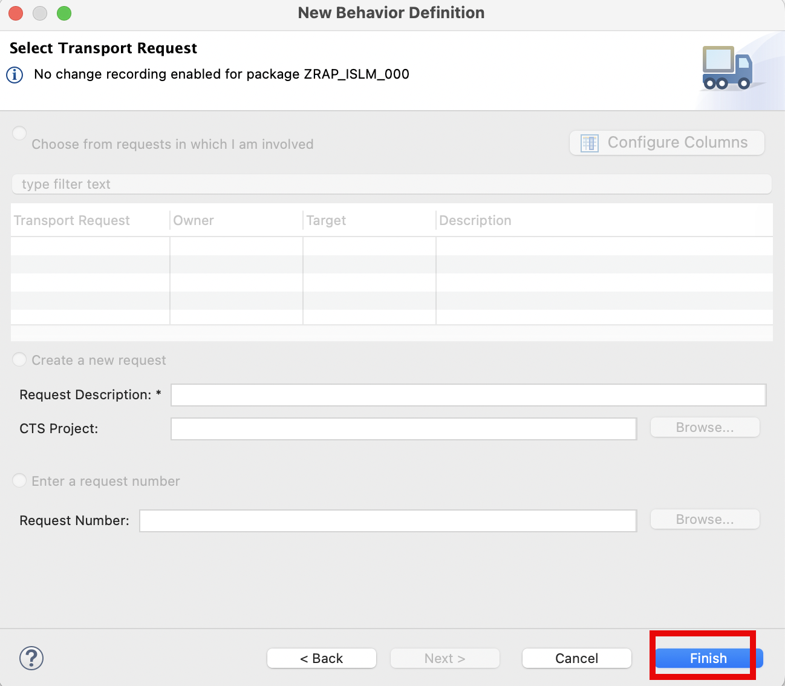
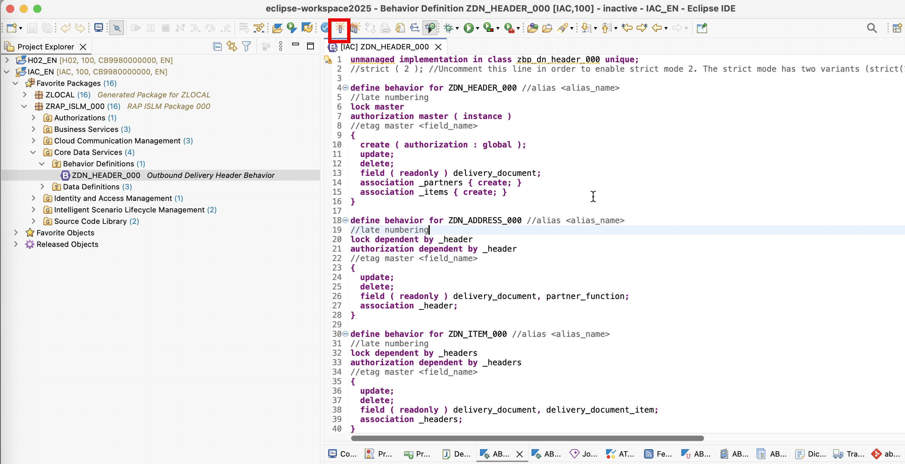
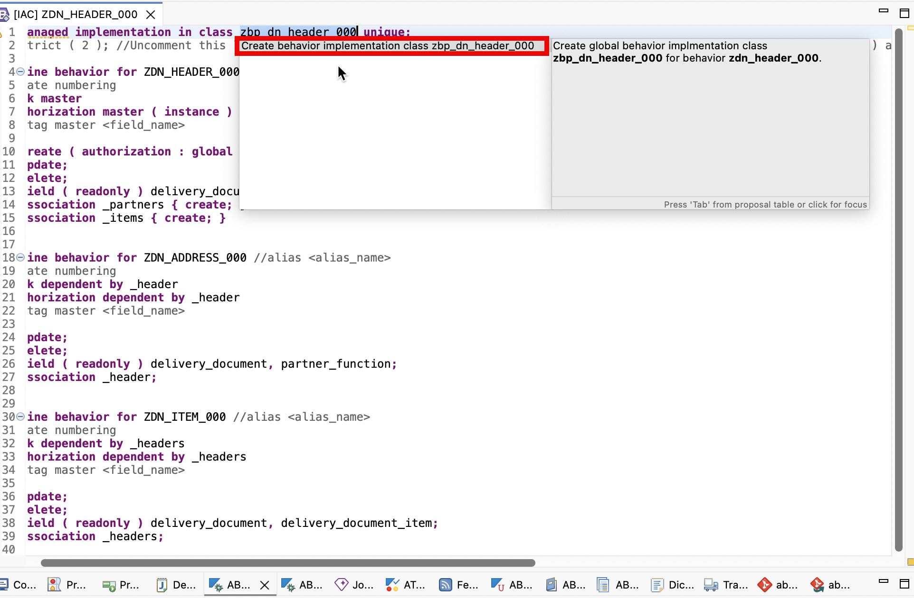
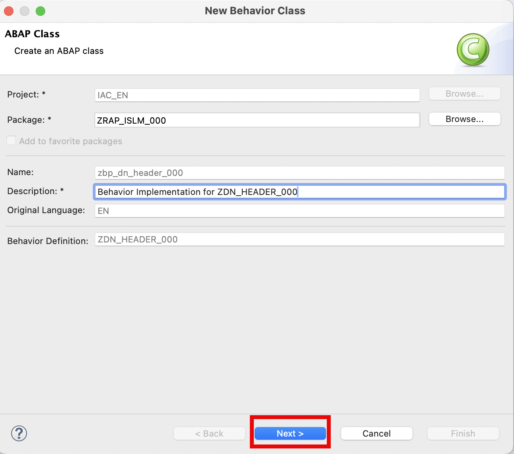
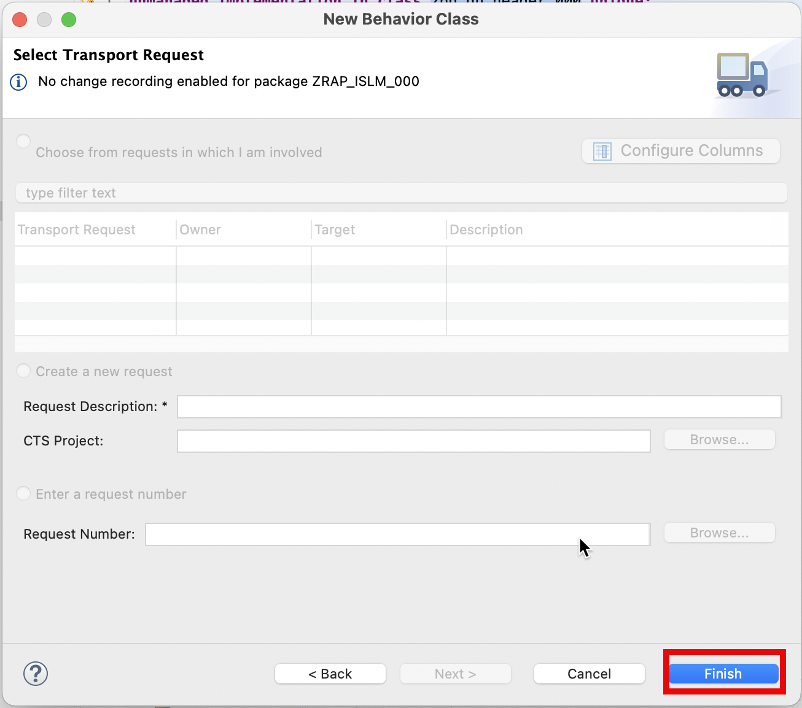
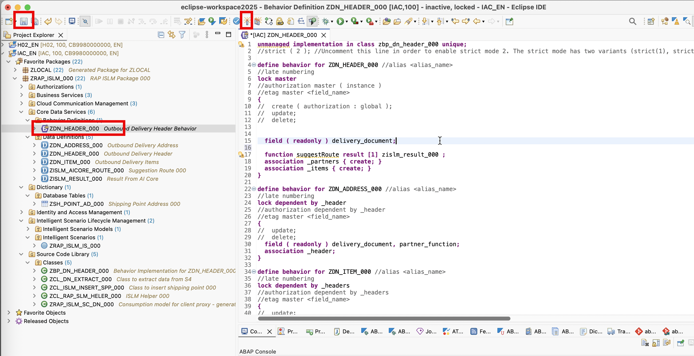
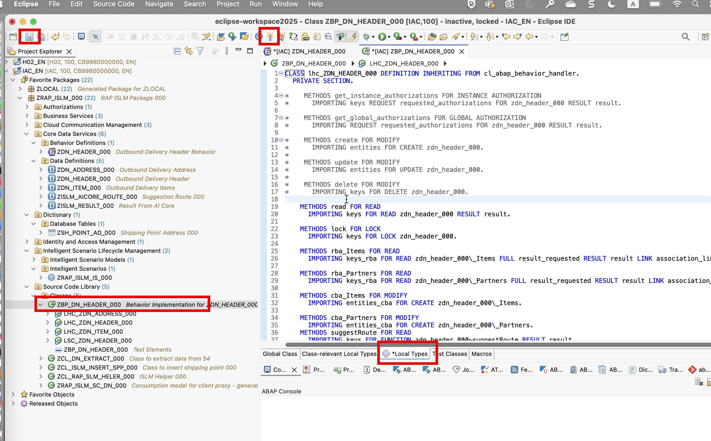

## Create Behavior Definition in Eclipse ADT.

## Procedure:

1. Right-click on your data definition `ZDN_HEADER_###` and select **New Behavior Definition** from the context menu.

   

2. Provide :

- Description: `Outbound Delivery Header Behavior`

  

3. Click **Next**

   

4. Click **Finish**

   

5. Click on **Save** and **Activate**.

   

6. Select `zbp_dn_header_###`, then select `Create behavior implementation class zbp_dn_header_###`

   

7. Provide:

   - Description: `Behavior Implementation for ZDN_HEADER_###`

   

8. Click on **Finish**

9. Replace the code of **Behavior Definition** `ZDN_HEADER_###` with the following code .

   ```
   unmanaged implementation in class zbp_dn_header_### unique;
   //strict ( 2 ); //Uncomment this line in order to enable strict mode 2. The strict mode has two variants (strict(1), strict(2)) and is prerequisite to be future proof regarding syntax and to be able to release your BO.

   define behavior for ZDN_HEADER_### //alias <alias_name>
   //late numbering
   lock master
   //authorization master ( instance )
   //etag master <field_name>
   {
   //  create ( authorization : global );
   //  update;
   //  delete;
   field ( readonly ) delivery_document;
   function suggestRoute result [1] zislm_result_### ;
   association _partners { create; }
   association _items { create; }
   }

   define behavior for ZDN_ADDRESS_### //alias <alias_name>
   //late numbering
   lock dependent by _header
   //authorization dependent by _header
   //etag master <field_name>
   {
   //  update;
   //  delete;
   field ( readonly ) delivery_document, partner_function;
   association _header;
   }

   define behavior for ZDN_ITEM_### //alias <alias_name>
   //late numbering
   lock dependent by _headers
   //authorization dependent by _headers
   //etag master <field_name>
   {
   //  update;
   //  delete;
   field ( readonly ) delivery_document, delivery_document_item;
   association _headers;
   }

   ```

   > Note: Please replace `###` with your own **group id**.

   

10. Click on **Save** and **Activate**.

11. Replace the code of **Class** `zbp_dn_header_###` on **Local Types** Tab with the following code.

    ```
    CLASS lhc_ZDN_HEADER_### DEFINITION INHERITING FROM cl_abap_behavior_handler.
    PRIVATE SECTION.

    *    METHODS get_instance_authorizations FOR INSTANCE AUTHORIZATION
    *      IMPORTING keys REQUEST requested_authorizations FOR zdn_header_### RESULT result.

    *    METHODS get_global_authorizations FOR GLOBAL AUTHORIZATION
    *      IMPORTING REQUEST requested_authorizations FOR zdn_header_### RESULT result.

    *    METHODS create FOR MODIFY
    *      IMPORTING entities FOR CREATE zdn_header_###.
    *
    *    METHODS update FOR MODIFY
    *      IMPORTING entities FOR UPDATE zdn_header_###.
    *
    *    METHODS delete FOR MODIFY
    *      IMPORTING keys FOR DELETE zdn_header_###.

        METHODS read FOR READ
        IMPORTING keys FOR READ zdn_header_### RESULT result.

        METHODS lock FOR LOCK
        IMPORTING keys FOR LOCK zdn_header_###.

        METHODS rba_Items FOR READ
        IMPORTING keys_rba FOR READ zdn_header_###\_Items FULL result_requested RESULT result LINK association_links.

        METHODS rba_Partners FOR READ
        IMPORTING keys_rba FOR READ zdn_header_###\_Partners FULL result_requested RESULT result LINK association_links.

        METHODS cba_Items FOR MODIFY
        IMPORTING entities_cba FOR CREATE zdn_header_###\_Items.

        METHODS cba_Partners FOR MODIFY
        IMPORTING entities_cba FOR CREATE zdn_header_###\_Partners.
        METHODS suggestRoute FOR READ
        IMPORTING keys FOR FUNCTION zdn_header_###~suggestRoute RESULT result.

    ENDCLASS.

    CLASS lhc_ZDN_HEADER_### IMPLEMENTATION.

    *  METHOD get_instance_authorizations.
    *  ENDMETHOD.
    *
    *  METHOD get_global_authorizations.
    *  ENDMETHOD.
    *
    *  METHOD create.
    *  ENDMETHOD.
    *
    *  METHOD update.
    *  ENDMETHOD.
    *
    *  METHOD delete.
    *  ENDMETHOD.

    METHOD read.
        DATA:
        ls_entity_key    TYPE zrap_islm_sc_dn_###=>tys_a_outb_delivery_header_typ,
        ls_business_data TYPE zrap_islm_sc_dn_###=>tys_a_outb_delivery_header_typ,
        lo_http_client   TYPE REF TO if_web_http_client,
        lo_resource      TYPE REF TO /iwbep/if_cp_resource_entity,
        lo_client_proxy  TYPE REF TO /iwbep/if_cp_client_proxy,
        lo_request       TYPE REF TO /iwbep/if_cp_request_read,
        lo_response      TYPE REF TO /iwbep/if_cp_response_read.

        TRY.
            DATA(lo_destination) = cl_http_destination_provider=>create_by_comm_arrangement(
                                                        comm_scenario  = 'ZRAP_ISLM_CS_DN_###'
                                                        comm_system_id = 'ZRAP_ISLM_COM_SYS_S4H_###'
                                                        service_id     = 'ZRAP_ISLM_OBS_DN_###_REST' ).
            lo_http_client = cl_web_http_client_manager=>create_by_http_destination( lo_destination ).

            lo_client_proxy = /iwbep/cl_cp_factory_remote=>create_v2_remote_proxy(
    EXPORTING
        is_proxy_model_key       = VALUE #( repository_id       = 'DEFAULT'
                                            proxy_model_id      = 'ZRAP_ISLM_SC_DN_###'
                                            proxy_model_version = '0001' )
        io_http_client             = lo_http_client
    iv_relative_service_root   = '/' ).

            ASSERT lo_http_client IS BOUND.

            READ TABLE keys INDEX 1 INTO DATA(key).
            ls_entity_key = VALUE #(
            delivery_document  = key-delivery_document ).

            lo_resource = lo_client_proxy->create_resource_for_entity_set( 'A_OUTB_DELIVERY_HEADER' )->navigate_with_key( ls_entity_key ).

            lo_response = lo_resource->create_request_for_read( )->execute( ).
            lo_response->get_business_data( IMPORTING es_business_data = ls_business_data ).

            APPEND CORRESPONDING #(  ls_business_data   ) TO result .
        CATCH /iwbep/cx_cp_remote INTO DATA(lx_remote).
            " Handle remote Exception
            " It contains details about the problems of your http(s) connection

        CATCH /iwbep/cx_gateway INTO DATA(lx_gateway).
            " Handle Exception

        CATCH cx_web_http_client_error INTO DATA(lx_web_http_client_error).
            " Handle Exception
            RAISE SHORTDUMP lx_web_http_client_error.
        CATCH cx_http_dest_provider_error.
            "handle exceptionS
        ENDTRY.
    ENDMETHOD.

    METHOD lock.
    ENDMETHOD.

    METHOD rba_Items.
        DATA:
        lt_business_data_items TYPE TABLE OF zrap_islm_sc_dn_###=>tys_a_outb_delivery_item_type,
        wa_business_data_items TYPE  zrap_islm_sc_dn_###=>tys_a_outb_delivery_item_type,
        lo_http_client         TYPE REF TO if_web_http_client,
        lo_client_proxy        TYPE REF TO /iwbep/if_cp_client_proxy,
        lo_request             TYPE REF TO /iwbep/if_cp_request_read_list,
        lo_response            TYPE REF TO /iwbep/if_cp_response_read_lst.
        DATA:
        lo_filter_factory          TYPE REF TO /iwbep/if_cp_filter_factory,
        lo_filter_nodes            TYPE TABLE OF REF TO /iwbep/if_cp_filter_node,
        lo_filter_node_1           TYPE REF TO /iwbep/if_cp_filter_node,

        lt_range_delivery_document TYPE RANGE OF zdn_header_###-delivery_document,

        wa_dn_items_response       TYPE  zdn_item_###.
        TRY.
            DATA(lo_destination) = cl_http_destination_provider=>create_by_comm_arrangement(
                                                        comm_scenario  = 'ZRAP_ISLM_CS_DN_###'
                                                        comm_system_id = 'ZRAP_ISLM_COM_SYS_S4H_###'
                                                        service_id     = 'ZRAP_ISLM_OBS_DN_###_REST' ).
            lo_http_client = cl_web_http_client_manager=>create_by_http_destination( lo_destination ).

            lo_client_proxy = /iwbep/cl_cp_factory_remote=>create_v2_remote_proxy(
    EXPORTING
        is_proxy_model_key       = VALUE #( repository_id       = 'DEFAULT'
                                            proxy_model_id      = 'ZRAP_ISLM_SC_DN_###'
                                            proxy_model_version = '0001' )
        io_http_client             = lo_http_client
    iv_relative_service_root   = '/' ).
            ASSERT lo_http_client IS BOUND.

            lo_request = lo_client_proxy->create_resource_for_entity_set( 'A_OUTB_DELIVERY_ITEM' )->create_request_for_read( ).

            lo_filter_factory = lo_request->create_filter_factory( ).
            lt_range_delivery_document = VALUE #( ( sign = 'I' option = 'EQ' low = keys_rba[ 1 ]-delivery_document ) ).
            lo_filter_node_1  = lo_filter_factory->create_by_range( iv_property_path = 'DELIVERY_DOCUMENT'
                                                                it_range         = lt_range_delivery_document ) .

            lo_request->set_filter( lo_filter_node_1 ).

            lo_request->request_count( ).

            lo_request->set_top( 30 )->set_skip( 0 ).
            lo_response = lo_request->execute( ).

            lo_response->get_business_data( IMPORTING et_business_data = lt_business_data_items ).
            LOOP AT lt_business_data_items INTO WA_business_data_items .
            MOVE-CORRESPONDING WA_business_data_items TO wa_dn_items_response .
    *                APPEND wa_dn_items_response TO it_dn_items_response .
            APPEND CORRESPONDING #(  wa_dn_items_response   ) TO result .

            ENDLOOP.
        CATCH /iwbep/cx_cp_remote INTO DATA(lx_remote).
            " Handle remote Exception
            " It contains details about the problems of your http(s) connection

        CATCH /iwbep/cx_gateway INTO DATA(lx_gateway).
            " Handle Exception

        CATCH cx_web_http_client_error INTO DATA(lx_web_http_client_error).
            " Handle Exception
            RAISE SHORTDUMP lx_web_http_client_error.
        CATCH cx_http_dest_provider_error.
            "handle exception
        ENDTRY.
    ENDMETHOD.

    METHOD rba_Partners.
        DATA:
        ls_entity_key    TYPE zrap_islm_sc_dn_###=>tys_a_outb_delivery_address__2,
        ls_business_data TYPE zrap_islm_sc_dn_###=>tys_a_outb_delivery_address__2,
        lo_http_client   TYPE REF TO if_web_http_client,
        lo_resource      TYPE REF TO /iwbep/if_cp_resource_entity,
        lo_client_proxy  TYPE REF TO /iwbep/if_cp_client_proxy,
        lo_request       TYPE REF TO /iwbep/if_cp_request_read,
        lo_response      TYPE REF TO /iwbep/if_cp_response_read.
        TRY.
            DATA(lo_destination) = cl_http_destination_provider=>create_by_comm_arrangement(
                                                        comm_scenario  = 'ZRAP_ISLM_CS_DN_###'
                                                        comm_system_id = 'ZRAP_ISLM_COM_SYS_S4H_###'
                                                        service_id     = 'ZRAP_ISLM_OBS_DN_###_REST' ).
            lo_http_client = cl_web_http_client_manager=>create_by_http_destination( lo_destination ).

            lo_client_proxy = /iwbep/cl_cp_factory_remote=>create_v2_remote_proxy(
    EXPORTING
        is_proxy_model_key       = VALUE #( repository_id       = 'DEFAULT'
                                            proxy_model_id      = 'ZRAP_ISLM_SC_DN_###'
                                            proxy_model_version = '0001' )
        io_http_client             = lo_http_client
    iv_relative_service_root   = '/' ).
            ASSERT lo_http_client IS BOUND.

            ls_entity_key = VALUE #(
            delivery_document  = keys_rba[ 1 ]-delivery_document
            partner_function   = 'SH' ).
            " Navigate to the resource
            lo_resource = lo_client_proxy->create_resource_for_entity_set( 'A_OUTB_DELIVERY_ADDRESS_2' )->navigate_with_key( ls_entity_key ).

            " Execute the request and retrieve the business data
            lo_response = lo_resource->create_request_for_read( )->execute( ).
            lo_response->get_business_data( IMPORTING es_business_data = ls_business_data ).

            APPEND CORRESPONDING #(  ls_business_data   ) TO result .
        CATCH /iwbep/cx_cp_remote INTO DATA(lx_remote).
            " Handle remote Exception
            " It contains details about the problems of your http(s) connection

        CATCH /iwbep/cx_gateway INTO DATA(lx_gateway).
            " Handle Exception

        CATCH cx_web_http_client_error INTO DATA(lx_web_http_client_error).
        ENDTRY.
    ENDMETHOD.
    METHOD cba_Items.
    ENDMETHOD.

    METHOD cba_Partners.
    ENDMETHOD.

    METHOD suggestRoute.

        DATA: lv_shippoint TYPE zdn_header_###-shipping_point,
            ls_shippoint TYPE zsh_point_ad_###,
            lv_ai_result TYPE zislm_aicore_route_###.
        DATA(lo_islm_helper) = NEW zcl_rap_slm_heler_###(  ).

        "alert 'the method has been called'

        READ ENTITIES OF zdn_header_### IN LOCAL MODE
        ENTITY zdn_header_###
            ALL FIELDS WITH CORRESPONDING #( keys )
            RESULT DATA(headers)
            FAILED failed.
        READ ENTITIES OF zdn_header_### IN LOCAL MODE
        ENTITY zdn_header_### BY \_items
            ALL FIELDS WITH CORRESPONDING #( headers )
            RESULT DATA(./img/items)
            FAILED failed.
        READ ENTITIES OF zdn_header_### IN LOCAL MODE
        ENTITY zdn_header_### BY \_partners
            ALL FIELDS WITH CORRESPONDING #( headers )
            RESULT DATA(partners)
            FAILED failed.

        READ TABLE headers INDEX 1 INTO DATA(wa_header) .

        lv_shippoint = wa_header-shipping_point .

        SELECT SINGLE * FROM zsh_point_ad_### WHERE shipping_point  = @lv_shippoint INTO @ls_shippoint   .

        DATA: lv_items_string    TYPE string,
            lv_shipfrom_string TYPE string,
            lv_shipto_string   TYPE string.

        CALL TRANSFORMATION id  SOURCE data = items RESULT XML lv_items_string.

        CALL TRANSFORMATION id  SOURCE data = partners RESULT XML  lv_shipto_string.

        CALL TRANSFORMATION id  SOURCE data = ls_shippoint  RESULT XML  lv_shipfrom_string.
        READ TABLE keys ASSIGNING FIELD-SYMBOL(<wa>) INDEX 1 .
        DATA(dnId) = xco_cp=>string( <wa>-delivery_document )->value.

        DATA wa1      LIKE  LINE OF  result .
        wa1-delivery_document = dnId.
        wa1-%param-shipItemInfo = lv_items_string.
        wa1-%param-shipToInfo = lv_shipto_string.
        wa1-%param-shipFromInfo = lv_shipfrom_string .
        lv_ai_result  = lo_islm_helper->suggestroute( iv_shipinfo = wa1-%param ).
        wa1-%param-routInfo = lv_ai_result-routInfo .

        APPEND wa1 TO result.

    ENDMETHOD.

    ENDCLASS.

    CLASS lhc_ZDN_ADDRESS_### DEFINITION INHERITING FROM cl_abap_behavior_handler.
    PRIVATE SECTION.

    *    METHODS update FOR MODIFY
    *      IMPORTING entities FOR UPDATE zdn_address_###.
    *
    *    METHODS delete FOR MODIFY
    *      IMPORTING keys FOR DELETE zdn_address_###.

        METHODS read FOR READ
        IMPORTING keys FOR READ zdn_address_### RESULT result.

        METHODS rba_Header FOR READ
        IMPORTING keys_rba FOR READ zdn_address_###\_Header FULL result_requested RESULT result LINK association_links.

    ENDCLASS.

    CLASS lhc_ZDN_ADDRESS_### IMPLEMENTATION.

    *  METHOD update.
    *  ENDMETHOD.
    *
    *  METHOD delete.
    *  ENDMETHOD.

    METHOD read.
    ENDMETHOD.

    METHOD rba_Header.
    ENDMETHOD.

    ENDCLASS.

    CLASS lhc_ZDN_ITEM_### DEFINITION INHERITING FROM cl_abap_behavior_handler.
    PRIVATE SECTION.

    *    METHODS update FOR MODIFY
    *      IMPORTING entities FOR UPDATE zdn_item_###.
    *
    *    METHODS delete FOR MODIFY
    *      IMPORTING keys FOR DELETE zdn_item_###.

        METHODS read FOR READ
        IMPORTING keys FOR READ zdn_item_### RESULT result.

        METHODS rba_Headers FOR READ
        IMPORTING keys_rba FOR READ zdn_item_###\_Headers FULL result_requested RESULT result LINK association_links.

    ENDCLASS.

    CLASS lhc_ZDN_ITEM_### IMPLEMENTATION.

    *  METHOD update.
    *  ENDMETHOD.
    *
    *  METHOD delete.
    *  ENDMETHOD.

    METHOD read.
    ENDMETHOD.

    METHOD rba_Headers.
    ENDMETHOD.

    ENDCLASS.

    CLASS lsc_ZDN_HEADER_### DEFINITION INHERITING FROM cl_abap_behavior_saver.
    PROTECTED SECTION.

        METHODS finalize REDEFINITION.

        METHODS check_before_save REDEFINITION.

        METHODS save REDEFINITION.

        METHODS cleanup REDEFINITION.

        METHODS cleanup_finalize REDEFINITION.

    ENDCLASS.

    CLASS lsc_ZDN_HEADER_### IMPLEMENTATION.

    METHOD finalize.
    ENDMETHOD.

    METHOD check_before_save.
    ENDMETHOD.

    METHOD save.
    ENDMETHOD.

    METHOD cleanup.
    ENDMETHOD.

    METHOD cleanup_finalize.
    ENDMETHOD.

    ENDCLASS.

    ```

> Note: Please replace `###` with your own **group id**.



12. Click on **Save** and **Activate**.
